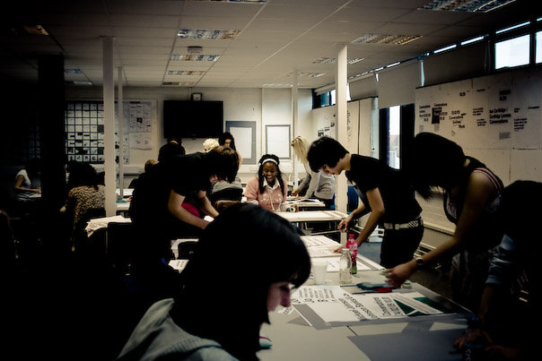

One of the articles I’ve been meaning to write for a while is a
summation of my thoughts on Design School, and its relevancy in 2011.
By ‘a while’ I mean at least the 3 years I was in university education
for; I also did a UK college Graphic Design course (the equivalent of US
Community College?) for two years before that.

**So I’ve been in, around, and thinking about Design Education for a
long time**; I’m just really shit at finishing blog posts. But I have a
shiny new blog urging me to write on. So here we go, stream of
conciousness style.

> Before I start, it’s been difficult over the years to restrain public
> ranting about Ravensbourne. What follows is a completely objective
> post about my experience there, after the dust has had sufficient time
> to settle; it’s more rational and less emotional than the drafts I’ve
> written over the years.

### The Good.

Learning typography in a traditional setting, from people who have been
there (Basel/Zurich), done that, and kerned the t-shirt. Typesetting _by
hand, on paper_. Learning about grids, 1-on-1, from actual Modernists
who actually knew Muller-Brockmann. **Having Wim fucking Crouwel come in
for an intimate lecture on your birthday**.

Spending three years in a studio with classmates— laughing, joking,
kerning, stressing out, sticking in, cutting out, learning together
and **teaching each other**. Having older students to look up to, and
having younger students to (hopefully) pass things on to. **Just being
in that environment for that amount of time is incredibly valuable.**

**You can’t replicate that learning from home** (due to the internet not
being the greatest setting for learning design), or at an
internship/apprenticeship/etc (due to time constraints), but I’m not
sure it’s valuable enough to justify the investment.

### The Bad.

**Feeling like The Good Ship Web Design is sailing off without you_.
_**Thinking you’ve had enough learning and want to start doing. Right
now.** Before another amazing site gets launched that you didn’t have
the chance to work on.** Because you’re sat in a classroom meeting
unproductive assessment criteria when you could be doing meaningful
work. Seeing younger designers (who haven’t committed to years of
education) achieve great things, and curse yourself for being stuck in
this situation.

**On Sketchbooks, and ticking boxes: **of course we have to learn to
design on paper. No one disputes that. Going straight to the Mac is a
mistake we’re all guilty of in the early stages of our careers, and we
could all stand to keep better visual scrapbooks. **Sketchbooks are
brilliant.**

**But not when they’re a key component of assessment**. I’m dyspraxic
and, to cut to the chase, when I’m in **the zone** I can’t slow down,
print out what I’m doing, neatly cut it out and stick it into a
sketchbook, then annotate it just to show the assessors my thought
process. Not without ruining my work and focus.

Just one example.

Outdated assessment styles and disability discrimination combining to
make for **mediocre outcomes**; just one example of how inappropriate
and self-serving design education has become. Nice. **If a degree has to
be compromised to be shoehorned in to the national education framework
then it’s not appropriate anymore. **

### Education can’t do digital.

The problem is BA (Hons) degrees need to be validated. They need to have
a set curriculum, with set projects and assessment criteria for those
projects. Web design is moving so fast that just taking an hour out to
write this post has caused me to fall behind(!). **There’s no way that
something as fast moving as web design can be shoehorned into a 3-year
validation cycle.** Ish.

**Front-end code can’t be taught in universities.** Period. It’s moving
too fast. C++ and Java can be taught, but they’re not moving at
breakneck pace. **Let’s forget the idea of web design education
requiring a code component.** I just can’t see a way it can be done. **I
still passionately believe that every graduating designer should know
how to write HTML and CSS, but the classroom isn’t the place for it.**

What the classroom **can** teach is design for the web. User Experience
design. **How to think like a web designer, rather than a print designer
doing a website**. Big difference. And that’s not being taught properly
because the staff aren’t in place. With such a high demand for good web
designers at the moment who would choose to teach? What you get is
tutors who honed their skills as print designers being told by
management to ‘make things digital’. It doesn’t work.

But that’s the only hope I can see for design education - **have
relevant tutors teaching relevant design, or die**.

### The Outcome.

Things worked out for me in the end, but I wonder if it was directly a
result of design education as a system, or a combination of chances on
the side. One example is if Ravensbourne hadn’t scrapped its analog
facilities (screenprinting, letterpress, darkroom) I would have been
content making posters. Without these facilities I became jaded with
print design which led me to web design. **In a roundabout,
unintentional way, my education made me a web designer.**

But that’s just my story - knowing what I know now, I don’t think I
could recommend any design course apart from [Hyper
Island](http://www.hyperisland.se/). Possibly some of the [UAL
colleges](http://www.arts.ac.uk/) if you’re intent on being a print
designer at the end of it but** so was I**.

### ‘But I want to be a print designer!’

In 3 years I’m sure the web will be even a more attractive prospect than
it is today, and I think you’d be foolish to not pursue a career in
digital design.** Seriously. It’s awesome.**

### What are the other options?

Try to find a job somewhere that will teach you the ropes. Not an agency
still creating Flash or tables. Apprenticeships like [Mark
Boulton](http://www.markboulton.co.uk/journal/comments/want-to-be-our-apprentice)
was offering are a great idea. I don’t have the answers yet, but I do
know that design school shouldn’t be the best one. I really hope some
day we can solve this problem, because there **are** positives to formal
design education. I’m just incredibley jaded by my experiences.

