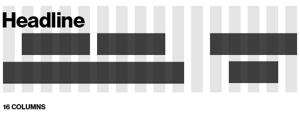

If there's one thing I love more than talking about technology and looking at typefaces, it's burgers. My stomach was pleasantly surprised to discover In-N-Out Burger whilst living in San Francisco this summer but something else struck me about visiting the restaurant.

They're a great case study in contrast. Contrast is _the_ differentiating factor in turning otherwise good work to great - from typography and grid systems to whole product lines. I'll get back to the design and tech in a minute, but first, burgers.

### Burgers and Choice Paralysis

For those who haven’t visited, In-N-Out Burger sell three burgers - the hamburger, the cheeseburger, and the double cheeseburger. No vegetarian burger, no chicken burger, no fish burger. No Texas BBQ burger, no Angus Bacon Double Whopper Extreme burger.

Just a burger, a burger with cheese, and a burger with cheese and more meat. Easy to pick, easy for the franchise to make, easy product line to maintain. Better by less.

Let's compare that to [McDonalds’ menu](http://www.mcdonalds.com/us/en/full_menu_explorer.html). I count 57 burgers, main salads and wraps; that's before we get to sides and desserts.

Perhaps three burgers is _too spartan_ a menu. That's fine - I'm partial to some chili and guacamole on my burgers from time to time, and vegetarian friends felt alienated when the rest of the group suggested eating at In-N-Out. But that doesn't mean that we should go back to the McDonalds option of having several dozen shitty products instead of three great ones though. Five options? Six? Seven? Some kind of reasonable compromise before descending into fast food choice paralysis hell.

Of course I'm not suggesting that we make a habit of eating fast food (or offering business advice to McDonalds), so let's look further afield. Where else do we have no product differentiation and ridiculous naming strategies? Technology, of course!

### The elephant in the phone store

If I was going to buy an Android phone I'd have a hard time making up my mind. “A Galaxy? A Nexus? A Nexus S? A Galaxy Nexus Droid Extreme SII Ace? Wait, a Galaxy Nexus is a thing? I thought they were separate products? Gah, sod it, I'll buy an iPhone”

This choice isn't empowering the consumer; it's not being kind and giving them options. It's two things - overpowering them with choice to scare them into buying something, and releasing a string of mediocre, expendable and replaceable products. Not cool.

Apple sell the new iPhone, the slightly older iPhone, and the old-but-still-better-than-any-Android iPhone. The three hamburgers.

### Size matters

Why won't Apple release a 4" iPhone and a 7" iPad? The In-N-Out Principle at work again. A 7" iPad would dilute the value of the 9.7" iPad. Different sizes suggest different use cases - a 7" iPad wouldn't be different enough to the 9.7" iPad to warrant different applications, context and mindset. It would just be a slightly squised 9.7" iPad.

Samsung have released or announced 5.4", 7", 7.7", 8.9" & 10.1" tablets (with multiple models of some); in addition to a range of phones which goes up to the 4.65" Galaxy Nexus. With such small gaps between products, Samsung has ruled out the possibility of unique and innovative uses. Fast food technology.

For more on choice paralysis and watered-down product lines, [Peter Bright’s article on Ars Technica about Ultrabooks](http://arstechnica.com/hardware/news/2011/09/ultrabook-intels-300-million-plan-to-beat-apple-at-its-own-game.ars/2) nails it - again compare Dell, HP or Toshiba's lineups to Apple's computers…wait, haven't I seen this somewhere before?

There it is.

iMac, PowerMac, iBook, PowerBook.

Hamburger, Cheeseburger, Double Cheeseburger.

Cut the shit - it increases the value of the sum of the parts.

### I’m bored of reading about Android and PCs, Jon

Good, I’m bored of writing about them! Let’s go back to graphic design. I've been meaning to write an article about the principles behind good grid systems for a while now.

In the same way as fewer burgers to choose from helps us make a decision and fill our stomach with meaty goodness, fewer possible combinations of grid units make each one stronger.

The simplified layouts below take the same basic shape  - using a more rigid grid with less flexibility makes for a more tense layout; increasing options makes the whole thing more sloppy.

And an example with more representative content - again the beauty of a grid (unity, contrast and tension) is lost with an increasing number of decreasingly significant options for content placement.

Again, I'm not suggesting that we should always stick to 4 column grids, but when you start your next project make sure you consider the implications and relevance of the grid you're working with. Less is often more.

### Surely you can't make typography about burgers too?

You bet! This is the big one. I've been [offering little tidbits of design advice](http://designedbygold.com/2011/10/calendar/) to early-stage startups and aspiring designers recently, and one thing that keeps coming up is refining typography. Not a huge overhaul, not the Swiss 'kerning tiny bits of paper by hand' exercises we were forced to do in design school (more on that another time) - just little tweaks and principles that make a world of difference. How? Limiting options, of course!

Creating and sticking to a strict type scale is a great first step. Limit the options of typefaces and weights. One typeface in one weight in one size can be effective; two weights, typefaces and sizes is fine. But using 5 typefaces on a site, in an inconsistent range of sizes and every weight they come in? You're back to McDonalds again.

In Josef Müller-Brockmann's seminal book '[Grid Systems in Graphic Design](http://www.amazon.co.uk/Grid-Systems-Graphic-Design-Typographers/dp/3721201450/ref=sr_1_5?ie=UTF8&qid=1319646813&sr=8-5)' there's a brilliant illustration of this concept - if you don't own the book then I highly recommend it.

Of course this principle isn't just applicable to graphic design, tablet computers and beefburgers - in almost any field or application, limiting choice makes each option stronger by itself and stronger as the sum of parts.

And next time you're in California, stop by In-N-Out.
