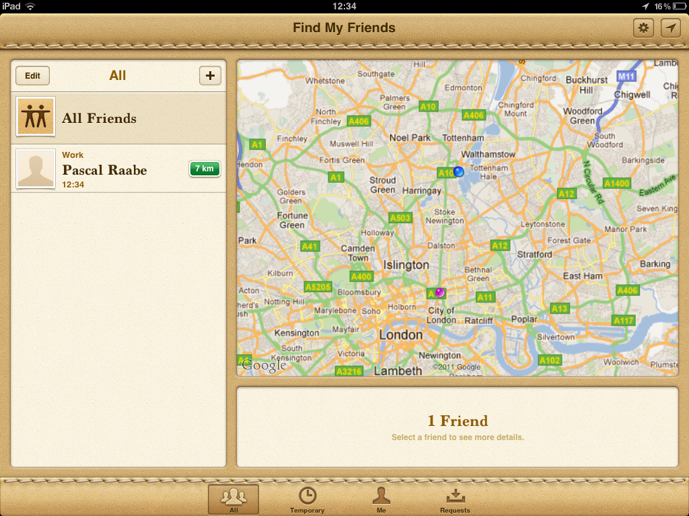

If the buttons in Aqua looked so good that you wanted to lick them, what
should a forward-thinking magazine app look like? So good that you want
to roll it up and swat a fly with it? I hope not - I don't want to break
my iPad.

> A skeuomorph is a design feature found on an imitation, pastiche or
> homage that was necessary only to the original. Often used for the
> sake of familiarity, they are details that have moved from function to
> form. —[Tom
> Petty](http://hipstercheerleaders.com/post/6981850000/how-to-talk-to-bolivian-hand-models-at-parties)

Often tacky, I'll grudgingly admit skeuomorphic interfaces can be
useful. Occasionally. Whilst not the most refined graphic solutions,
there's something to be said for familiarity. In moderation (and
depending on context) I often go for the beautiful-but-dated Calculator
app over the more progressive
[Soulver](http://www.marco.org/2010/03/11/overdoing-the-interface-metaphor).
For more complicated needs the flexibility of Soulver is invaluable, but
for quick additions the familiar metaphor of a Braun calculator is
passable.

### When the metaphor isn't referencing anything.

Calendar, Notes and Contacts are all explainable — they reference real
world things (_even if they shouldn't)_. My Mum likes that her calendar
looks more like a Filofax than Outlook 2003. Fair enough. A Filofax is
_a thing_. I get it. And the Compass app is based on a compass. Another
_thing_.

But I'm pretty sure there's not _a thing_ in my physical living room
called a 'Find My Friends'. The metaphor is empty. It's not referring to
anything. It's just a leather texture.

Paper doesn't scroll; much less so a digital map debossed into a
bevelled [Corinthian
leather](http://daringfireball.net/linked/2011/10/12/find-my-friends)
surround. It _can't_ be a thing.

It's when we've transcended reference to lazily base new interfaces on inconsistent real-world materials that things become dangerous.

We risk rooting ourselves in the past.

> I always wanted a leather bound stalking tool. Google Latitude was way too professional looking. —@jazzpazz

### So what do we do with no metaphor to go for?

A logical conclusion might be that skeuomorphism is so ingrained in Apple's visual language now that moving past it is impossible. That every new Apple app should be doused in texture. That the brand-new iTunes Movie Trailers app should be draped in red velvet curtains, with crushed popcorn scattered around.

That would be nice and familiar for users, wouldn't it?

Of course not.

Apple can and did build a better application in this case by avoiding the obvious metaphors and just _making a good app_.

It can be done.

### Neat! What other metaphors are broken?

Newspapers and magazines. The first wave of iPad newspaper apps was a skeuomorphic shitstorm. Accidentally picking up the print edition of The Metro ruins my morning commute, but [the iPad version](http://itunes.apple.com/gb/app/metro-tablet-edition/id463429891?mt=8) is infinitely worse. I get it. You like your columns and smudged ink. You don't want to put any design thought into this newfangled iPad business. Laziness won't win you any friends.

In contrast, the newly released Guardian app is brilliantly un-skeuomorphic. There are no [for-the-sake-of-it columns](http://www.informationarchitects.jp/en/wired-on-ipad-just-like-a-paper-tiger/), no [blackletter mastheads](http://itunes.apple.com/gb/app/the-early-edition/id363496943?mt=8), just a clean grid and perfect typography. I think it's a huge improvement over the vast majority of iOS news-delivery apps. As a vehicle for branded periodical content (as opposed to an aggregator such as Reeder) it might be the most forward-thinking app _period._

The Guardian _get it._

### And then Apple fuck it all up.

Newsstand is a problem. Having a single collection for all branded periodical content is awesome and useful. Having a single location for purchasing those apps is also awesome. Forcing that content into _another_ outdated metaphor—in this case a wooden shelf of printed media—is wrong. Especially when lots of the content (e.g. the Guardian) is pushing past that metaphor to create new, unique, and appropriate experiences.

The Guardian app breaks past the page/paper/column metaphor. Newsstand tries to neatly shovel it back into the days of print. For familiarity. [Familiarity that won't be present in the very near future](http://www.youtube.com/watch?v=aXV-yaFmQNk). It completely ignores the design direction the Guardian team have taken.

**It takes the easy way out, and as designers we don't believe in easy.**

### Yesterday's News

The transition from daily print newspapers to daily iPad news(~papers) has been uninspired. In the age of Twitter it seems ridiculous to wait for your news - breaking news is now instant; confirmed reporting and reaction comes within minutes and hours. By the time print newspapers report on the story it seems quaint and backwards. Old news.

Over the past few days there's been great discussion on Twitter about the place of the Guardian app - whether it is a step backwards or forwards, and whether we need daily editions of yesterday's news at all. Miles Cheverton hits some great points in [The Last Spasms of a Dying Business Model](http://thetalldesigner.com/blog/2011/10/15/the-last-spasms-of-a-dying-business-model-why-the-guardian-ipad-app-is-a-step-into-the-past/)

> [The Guardian] is trying to fit an old media paradigm (the daily print) into a world where days don’t really exist, into a world where we can update things as they happen, in a world where you can write an article about a terrorist attack as soon as it happens in 6 words, extend it to 6 paragraphs an hour later and extend that to a 6 section in depth analysis. None of the possibilities and advantages of working with a fast, constantly connected smart media device are used, even when doing so would be cheaper.

And I absolutely agree with this. I agreed with it so much that I wrote 10 000 words arguing the same thing for my dissertation a year ago. But then the Saturday edition of the paper landed (automatically) in my Newsstand this morning. And then I changed my mind about this particular metaphor. Kind of.

### Branded content is nice.

It's nice reading content by the Guardian. They're a brand I trust, whether in print, on the web or online.

### A curated collection of content is nice.

I appreciate the Guardian's curation of content - being able to flick through relevant things that I might otherwise miss on my strict diet of only reading articles linked to by John Gruber. Whilst they have _every_thing on their website, it's nice to just be shown _some_ things. Just the things that matter today.

### It doesn't have to compete with instant.

In the same way that the weekend newspapers are a more leisurely, editorial discussion rather than break-neck to-the-minute reporting, I see a future in 'trusted news sources' providing that editorial discussion. Realtime is great, but if you're adamant that a daily edition is good then make it interesting stuff we haven't read rather than what we read as it happened yesterday.

### Cognitive dissonance, Jon?

Not really. Two different metaphors. The visual metaphor and the daily edition metaphor. The issue I care most about is ridding the world of me-too skeumorphic monstrosities. I care that future apps for finding my friends don't look like a thrifted leather jacket, and I care that future digital content delivery mechanisms don't look like print newspapers.

The Guardian app doesn't look like print, it looks like the future. The content could do with **either** being realtime **or** focussing more on editorials, but for now the fact that it specifically doesn't look like its print edition is enough for me.

**The priority for us as visual designers should be to out-innovate skeuomorphism - not just for ourselves, but for the next generation.**

**The ones who will never pick up a printed newspaper or magazine.**
