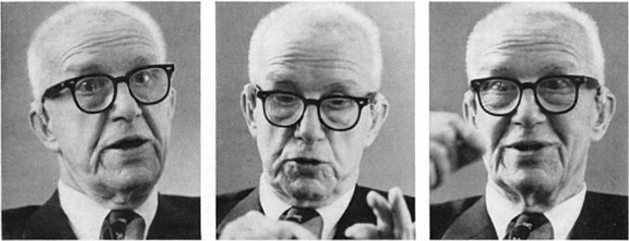

> After reading Marshall McLuhan’s excellent [Playboy
> interview](https://www.nextnature.net/2009/12/the-playboy-interview-marshall-mcluhan/)
> I figured I’d see if Buckminster Fuller, another hero of mine, had also been
> interviewed in Playboy. He had, but the only web version I could find was [a
> .pdf](https://bfi.org/sites/default/files/attachments/pages/CandidConversation-Playboy.pdf)
> so I figured I’d clean it up and present it as a text file. The markdown is
> [on
> GitHub](https://github.com/jongold/txt/blob/master/pages/2016/05/buckminster-fuller-interview.md) if that’s your thing. Enjoy!

🐰: Is there a single statement you could make that would express the spirit of your philosophy?

**FULLER**: I always try to point one thing out: if we do more with less, our resources are adequate to take care of everybody. All political systems are founded on the premise that the opposite is true. We’ve been assuming all along that failure was certain, that our universe was running down and it was strictly you or me, kill or be killed as long as it lasted. But now, in our century, we’ve discovered that man can be a success on his planet, and this is the great change that has come over our thinking.

🐰: If that kind of awareness has really come over us, why isn’t there more rejoicing?

**FULLER**: The changes taking place are still unfamiliar to everybody, even to those who expect change. If you start plotting the changes that are occurring, the most difficult to plot is the change of attitude, the change of awareness. But I’ve been at it long enough to really see these changes, and I tell you the acceleration is terrific. I can see this world of man coming on very rapidly.

🐰: Meanwhile, though, the world still seems pretty hostile.

**FULLER**: That’s the conditioned reflex. The utter helplessness of the child requires a parent. And parents look out for a number of children, so the children assume there is a big man to watch over them. That gets to be a conditioned reflex. We find ourselves in trouble and look for a bigger and tougher guy, someone who’ll say, “All right, follow me and we’re going out to eat. There are some people who’ve got some stuff over there and we’re going to knock them on the head and take it away from them.” If you go back to the earliest days of humans on our planet, you’ll note that, among the advanced mammals, nature seems to have chosen fighting as a way of determining which of the males would dominate the group. We see a stallion born among many stallions, and he’s a little bigger and tougher than the others and that makes him a challenge to the speediest and most powerful, and there’s a fight between the two and the one wins disseminates the species. The others can just go hump.’ Imagine how this happened with man - man in great ignorance, born with hunger, born with the need to regenerate, not knowing whether or not he’ll survive. He begins by observing that the people who eat roots and berries very often get poisoned by them, and he sees that the animals that don’t eat those things don’t get poisoned. So he kills those animals and finds their flesh safe and it gives him a lot of energy in a hurry. So the most powerful men start grouping together to control the meat. And that’s been the tradition. There wasn’t enough to go around and somebody had to go down.

🐰: But that isn’t the case any longer?

**FULLER**: No. I’m absolutely convinced of it. It’s only ignorance that makes it continue to appear so. Even when I was a kid, we had comprehensive illiteracy. Man was still very ignorant, and his ignorance led to fear for his own skin. You have to remember that, early in the history of man, life was so bad that they couldn’t even think of anything good about it. Therefore, they said the whole thing was just a trial for another kind of life in some other place. And the people had such awful feelings of inadequacy that they went for the idea that the afterlife was for the Pharaoh only. Then they began to have a little more success; they began to understand a few principles that made life a tiny bit easier, and they began to say that the afterlife was for the Pharaoh and the nobles; that came in the second set of dynasties. Then there got to be a little more discovery of this and that, and finally they said, well, we can take care of the afterlife of all citizens, by which they meant the middle class: that’s our Greek and Roman history. Then there got to be so much knowledge by the time of the beginnings of Buddhism, Christianity and Islam that they found they could look out for the afterlife of everybody. And that’s been our history for 1900 years - the woman in her black shawl inside the great cathedral, experiencing the ecstasy of knowing that in her afterlife she’ll be able to join all the people she loves. But all this time, there’s man having experience in producing tools and figuring out the engineering of those great cathedrals and pyramids, gradually developing such a great tool capability that he said. “Now we can take care of the afterlife of everybody and also the living life of the king.” This was a brandnew idea for humanity. This was the moment of the divine right of kings, a major change for mankind. And then, in the time of the Magna Carta, the same idea was extended to the king and the nobles. And then they decided that they had the capability to care for the afterlife of everybody and the living life of the entire middle class, and that was the great breakthrough of the Victorian period that took us right up to yesterday. All the urbanism and social ideas and notions of property we have are built on those ideas. Now we find that they, too, are wearing thin - because we can do more. Suddenly man is able to increase the life span and improve the life style of everybody and have a very large number living far better than any 19th Century king. Just in this century, we’ve doubled the life span for 40 percent of humanity. At any rate, I think we may be coming into a phase now where there is only one universe, only one lifetime. I see a regenerative awareness coming on where, in the next age, we’ll be looking out for the afterlife and the living life not only of everybody alive but also of everybody to come. We won’t be burning up our fossil fuels and saying to the next generation, “How are you going to get on?” We’re coming into a phase of man’s being successful on board his planet, performing his function in a bigger way. Maybe we’ll be able to leave this planet and get on to others and fix them up as each one gets ready to become a star.

🐰: What are the signs of this new phase?

**FULLER**: Man is beginning to think in terms of one world. We used to think a lot about hell. In the old up-and-down infinite-plane world, with heaven above and hell below and the earth sandwiched in between, we used to imagine that fire below as if it could really burn us. But you don’t hear much talk about hell nowadays. It’s getting to be one universe, one life. We’re still very much involved in the metaphysical, the eternal, but now it’s the eternality of the human mind’s being able to discover generalized principles. In order for there to be a principle, it has to be eternal. So I see the temporal and eternal coming into complete interaction. Of course, we still have the schoolteacher saying, “Never mind universe, I want you to get your ABCs, your elementary education. When you know about the little things, the parts of things, then you can add them up and figure out everything.” And this is a complete fallacy, because universe is synergetic, and the behavior of the parts does not predict the behavior of the whole. Ask the scientist, “What is mass attraction?” He doesn’t have the slightest idea. He only knows it does it. It’s a relationship, not a thing. The why of it is an absolute mystery. Man can discover these relationships and behaviors, but he is utterly unaware of the a priori mystery. All our experiences have beginnings and endings. All are finite packages. That’s the way we think. We have this extraordinary mind that can make contact with those eternals and employ those principles; but we can only put them to specialized uses. So everything we experience physically is always a special case and always terminal.

🐰: This limits man’s potential, doesn’t it, as to his ability to identify his function in a universe of mystery?

**FULLER**: I’d call the hydrogen atom very successful, and I see no reason man shouldn’t be as well designed to fulfill his potential. It could be, however, that evolution is intent on bringing about a different kind of existence for man. For instance, consider the coral reef. It’s quite different from the individual walking man. In the coral reef, the individual little coral animal doesn’t even know the coral animals next to him. They keep building reefs, which are occupied by millions of individuals who have no knowledge of one another. It’s like the Queen Elizabeth going down the harbor when the lights are on at night, and it happens that a child is born on board about that moment, and in the next moment an old man dies on board. You don’t see that in those lights, because the Queen Elizabeth is like a floating coral reef where new life is coming in and old life is going out. In New York City, as you get up on high and see all the lights of the skyline, there are houses where people are dying and there are houses where people are being born. It’s a great coral reef too. There’s also a sort of continuity in the way each of our cells is dying and new ones are coming in. We are, in effect, walking coral reefs; the latest information discloses that 98 percent of the atoms of which we consist change annually. So we’re simply a kind of form, as the Queen Elizabeth is a form, with life going on inside. The atoms get changed, the people on board change, yet there is a sum-total form that goes on. You and I are walking, overlapping lifecell creations and life-cell deaths, atoms coming in and going out. So I don’t find it strange to think that we can interchange each other’s blood, each other’s eyes and livers. In the future, we’ll synthesize chemically all our constituents, so that eventually we might really be able to keep changing parts and keep ourselves going. This is implicit in what’s going on right now. There might someday be a continuous man. Man would then have an enormous information resource that would enable him to cope with much larger problems. I see man coming into quite a new function in relation to universe, a function having nothing to do anymore with the struggle to stay alive.

🐰: Nor with the struggle to perpetuate himself, it would seem. Wouldn’t these changes defeat the urge to procreate?

**FULLER**: If you think about it, it’s probably a very difficult design problem to get an organism to want to procreate. Go to the mirror and stick your tongue out and have a good look at it. If you didn’t have a tongue and a salesman came to your door and said, “I’d like to sell you one of these things; you stick it in your mouth and it does you a lot of good,” I doubt that you’d be very likely to buy it. If you were to take a look at your guts, at your kidneys, or if you had to go to a supermarket and buy a kit to make a baby, I don’t think you could put it together at all. If each of us could see all the organic equipment required to regenerate this extraordinary walking coral reef that we really are, I don’t think anybody would procreate. So to get us to procreate, nature gave us a beautiful covering that sort of simplifies all the frightening colors and coils and such. We have a simplified skin stretched over us and nature has done a lot of tricks trying to make this thing attractive enough so that procreation would occur. Now, regarding population, you find enormous numbers of human beings talking glibly about overpopulation who have no awareness of the subject at all. I’ve taken a lot of time to study population and have been doing it for a great many years, and I’ve found that you have to go back into two centuries of census information to really find something out. To do this, you go back into family Bibles and you find that the early Colonial settlers kept complete records of all births and deaths and marriages, and those early American fathers were averaging 13 children per family. But the mother often died in childbirth, then the child, as often as not, died of measles or diphtheria or consumption. The casualties were awful. And so the number surviving into adulthood was not high, despite all the babies. Then, as we began to get waterworks and the various things that help control environment, that help a man protect his family against deprivation and disease, down went the number of children per family and up went life expectancy. The average life expectancy in early America was somewhere around 19. The upward trend is still with us - life span going up, births going down. All this is pure fallout from industrialization. When nature has a poor chance of survival, she makes many starts; when her chances improve, she makes fewer. During all those thousands and thousands of years before our time, nature gave man the capacity to make many babies. Now, suddenly, she doesn’t need them anymore. So I’m not surprised to see girls dressing like boys and boys dressing like girls. I’m not surprised to see women getting naked, because the more naked they are, the more they tend to discourage the sex urge. Part of the procreative urge is man’s insatiable curiosity. If a woman is covered up with skirts, man is driven by curiosity: Take away the skirts and he says to hell with it. And I find us getting an enormous amount of homosexuality, which I see as nature supplying a negative urge that diminishes our capacity to make babies. Here, of course, the good-and-bad kind of idea has led us completely astray. So many things that are changing or coming to a stop tend to make people feel negative, but it’s simply nature winding up certain phases quite rapidly right now.

🐰: When you say nature, do you mean man?

**FULLER**: When I use the word nature, I sometimes mean God.

🐰: Do you ever say God and mean nature?

**FULLER**: People get confused over the word God. There is a long tradition that tells us that God is some kind of man. People in the early Greek days wanted to see what Venus looked like. I’m sure the original Greek thinkers didn’t have this anthropomorphic concept. But minds great enough to discover a principle had to deal with people who said, “Please make that clear to me,” and they began talking in experiential terms, developing allegories and similes. To talk about the procreative urge, they began to describe Venus, and the people listening began to pay attention to the example and they wanted to see what Venus looked like. Mr great aunt Margaret Fuller, who used to talk a great deal about the Greek gods a century ago, began to see them in terms of the principles they represented. And I found it interesting, when I studied electrical engineering, that when I considered such electromagnetic behaviors as conductance, impedance and resistance, I saw the Greek gods in those behaviors.

🐰: Then the presence of the gods was more evident to you in electricity than in the human personality?

**FULLER**: The human personality was a good way of explaining a principle, that’s all. And that is how man developed a lot of his anthropomorphic concepts of God. In our own era, Einstein brought back a nonanthropomorphic concept of God - God as the great integrity of universe. I find that in the Orient, this is very much understood.

🐰: Would you compare your own sense of the mystery of the universe to Einstein’s?

**FULLER**: Oh, very much so. I was deeply impressed when he wrote about his cosmic religious sense in “Religion and Science” in 1930. He wrote about the men who were identified by the Roman Catholic Church as the great heretics, and he said he thought those great scientists were much more imbued with a faith in God than the clerics were, because they recognized God in the mystery and integrity of universe. And he said, “What a faith must have inspired Kepler to spend all the nights of his life alone with the stars.” Most of the men of the Church didn’t understand that kind of faith, but I think Einstein had it very deeply.

🐰: And you share his belief?

**FULLER**: I think the word faith is much better than belief. Belief is when somebody else does the thinking. Most of our religions are that way, just full of credos and dogma. They are anti-thought, and that, to me, is anti-universe. Man has to discover his full significance, and only mind can do that.

🐰: Your notion of man’s significance seems to assume that he has an objective function in the universe. Where do you see him demonstrating any awareness of it?

**FULLER**: When you try to understand whether or not man has a function, you start by observing universe, not man. Universe is not a static picture but an extraordinary kind of scenario which I call a complex of partially overlapping, transforming events. People are born at different times; their children are born at different times; their lives are overlapping, transforming events. They die, but there’s a continuity of life that is the same continuity which is universe. Now, thinking about universe and trying to find man’s function, observe that the physicist has found that all systems are always losing energy. The energies that fit into our local system here on earth are energies given off by other systems. Every chemical element has its unique frequencies, and those frequencies can be thought of as the teeth of a gear. I’d like to amplify that a little with the example of synchronization. You have two engines in an airplane and they don’t turn over at exactly the same rate, so you hear rhooOWW, rhooOWW, rhooOWW. They come into phase and go out of phase. Universe is doing just that with these constantly associating and dissociating energies. Some take millions of years before they rhooOWW. But these energies appear disorderly merely because they are temporarily not meshing with something else. When the gears and the teeth don’t mesh, they take up more room. You get an omnidirectional crowding; things get moved faster and faster around the periphery to accommodate the continuous expansion of crowding and disorderliness. But the limit of that velocity is what Einstein called the speed of light, the speed of radiation of all kinds, 186,000 miles a second. This is top speed, because when you get to where everything’s in phase, all the crowding stops. In other words, energy in dissociation expands outwardly until it reaches the last cycle in the total regenerative system. We know about total regeneracy because physics has demonstrated that energy is never created nor lost. So we know that, as men alive in universe, we’re dealing in a finite system of overlapping scenarios in which, finally, the whole scenario tape gets melted down and reprinted and we get a new show.

🐰: That “melting down” could be cataclysmic for life on earth, couldn’t it? How do we know we’ll be in the new show?

**FULLER**: I’m trying to give you a comprehensive picture. Just let me paint the rest of it and I’m sure you’ll understand what I’m trying to say. Let’s go on to observe that we also have a fundamental law in physics that every phenomenon has a complementary phenomenon. Therefore, with the physical universe expanding and becoming increasingly disorderly, there must be someplace in universe that is contracting and becoming increasingly orderly. Our Spaceship earth is one such place. This is a place where energies are being collected. All the disorderly receipts of cosmic radiation from the sun and other stars impinge on our planet and its mantles. The radiation gets bent as it passes through the Van Allen belts, then bent again by our atmosphere, then bent still further by the three quarters of the earth that is covered by water. The water impounds the energy as heat. It takes on heat and loses it more slowly than any other substance, and three quarters of our planet happens to be covered by it. We’ve been given a very even relative temperature aboard our planet, where the annual variation of extremes is less than one degree Fahrenheit. And within this orderly temperature balance, life is able to regenerate in the biological species. You and I, no matter what our age or where we may be or what we may be wearing, give off 98.6 degrees in all seasons. That gives you an idea of the beautiful energy balance in our chemistries. Now, we also have, on board our planet, radiation impounded by vegetation on dry land and by algae in the sea. Photosynthesis gives us these beautiful set of ordinary conditions that gives us a profusion of molecular structures, these beautiful hydrocarbons. So there’s a tiny planet with a beautiful set of ordinary conditions that gives us a profusion of life and still lets the energies collect. Fish die and their cells filter down toward the bottom of the ocean. Trees and grasses and ferns go under, and as the winds and the various geological movements shift the soils, they get buried deeper and deeper, until finally, at about the 4000-foot depth, the pressures are such that their hydrocarbons undergo a change and we get coal and petroleum. Our earth is the one place we know about in universe where energy is physically collecting. What I’m looking for in this total picture is an answer to that one great question: Does man have a function in universe? And I find that among all the forms of biological life, man has one extraordinary capability, which is his mind. His brain is something he shares with many animals. It takes in the incoming smellies and feelies and video messages and deals with them as special-case experiences. But man’s mind alone can also perceive the relationships that exist among these special cases. It keeps surveying them and suddenly it finds one of these beautiful relationships. If you don’t know that something exists, there’s no way you can look for it, yet mind has the unique capacity of finding things out through intuition. And this gives man his marvelous capacity to discover generalized principles and employ them. This is man’s contact with the eternal we were speaking about, his ability to locate the absolute reliability of design, which is the eternal aspect of universe. What I’m saying is that the human mind may be part of the requirement of having a regenerative universe that never runs down. Just as all the biological life forms on earth are anti-entropic, decelerating and collecting energies into their very orderly biological molecules, so man’s mind sees the generalized principles, collects that information and discovers its significance and winds up employing it in a very big way. Just now man is becoming able to apprehend and employ the great principles and really begin to participate in evolutionary events. His function in universe is to do certain sortings that need to be done in order to maintain its total integrity. His information-gathering, sorting and rearranging capability is greater than any other such capability demonstrable in universe. The fact that universe discloses this kind of capability indicates that man has quite an important function. And our experience also teaches us that when universe has important functions to fulfill, it provides for the regeneration of these functions. Man could not regenerate himself alone and unassisted on board his planet. He is born absolutely helpless. Despite all his beautiful equipment and all his senses, he’s helpless. But we find that our planet has provided us with impounded energy that we can employ to make ourselves a total success in our environment and free ourselves to get on with our universal role.

🐰: And you’re saying that man is on the point of discovering that role?

**FULLER**: I think he’s just discovering himself in his full significance. The child in the womb is completely innocent and completely looked out for. Then he comes out and has to do his own breathing. Then he gets to his feet and has to do a little more. He takes on a little more responsibility and gains in self-discovery. Well, man is just now coming out of the womb of what I call permitted ignorance. The average man is beginning to realize why he is here in universe. That is exactly what young people are continually asking. When I talk to them, being a comprehensivist instead of a specialist, I find that they speculate and discover that they probably do have the function I’m talking about. And suddenly they change completely. I find that we’re in a moment of fantastic self-discovery and are approaching an entirely new relationship with our universe.

🐰: It seems a melodramatic kind of evolution that would have man verge so close to extinction before discovering what he’s here for. Do you think risking extinction may be part of the process of selfdiscovery?

**FULLER**: Man has always done it. He kept going to sea, kept going after those fish, and his boat was inadequate and he was lost. Of all the people who have gone to sea, I imagine very few have returned. There was such a loss in the beginning. But out of it, man gradually began to learn engineering, to learn how to anticipate the enormous stresses, the constant peril. And he began to develop beautiful fibers, better ropes, better sails. Our breakthroughs have always come when we were risking ourselves very close to the brink.

🐰: But only in recent years has man achieved the ability to bring everything on earth close to the brink.

**FULLER**: I disagree. He’s been on the brink all the time. He’s always had the ability to throw the stone and kill the other guy. He’s always been able to fall off the cliff. He’s always had time to freeze to death out there. He’s been on the brink the whole time.

🐰: But don’t you think the existence of the bomb constitutes an end-game sort of circumstance for mankind?

**FULLER**: Both Adam and Eve could have picked up stones and it would have been all over.

🐰: So, in a sense, there’s always been a bomb?

**FULLER**: There’s always been a bomb - you bet! And man had a far greater tendency to use it in his ignorance and awful hunger than he does today, with his awareness of the consequences and his ability to get on without it.

🐰: All the same, don’t you see time running out for man in terms of his being able to afford the luxury of trial and error?

**FULLER**: Oh, indeed. Not only do I see man as having a function in universe, which means he really is necessary to universe, but I also see that universe doesn’t take a chance on this little team down here on Spaceship Earth. We are infinitely tiny and insignificant. Very often, the flames of the sun rise 30 times the diameter of our little earth. The size of our show here on earth is something we really need to emphasize. I often say this to my audiences nowadays. I’m standing on the stage and behind me is an enormous projection screen, and I’ve got a slide that was taken through one of the giant telescopes. It represents about one ten-thousandth of the total celestial sphere and is absolutely riddled with tiny white stars. And I point out that our sun is one of the tiniest. We also know that it takes light four and a half years, coming at the rate of 700,000,000 miles an hour, to get to us from the next closest star. So I tell my audience, pick the smallest dot you can see on the screen behind me and imagine drawing a tiny circle around it almost as small as the dot itself. That microscopic area can be said to represent the solar system of which our earth is part. And then I have a voice rising in one of those cartoon voice balloons from this almost invisible dot, and the voice is saying, “Never mind that space stuff - let’s get down to earth!”

🐰: Despite that picture of man’s insignificance in space, you seem to be speaking of human life as being expressive of the “integrity” of the universe. Couldn’t it just as well be something with no meaning at all beyond this tiny planet?

**FULLER**: I speak of universe in two aspects, the physical and the metaphysical. And I talk about scenario universe as my interpretation of Einstein’s discovery of the speed of light. The significance of that discovery is that when we look out at the stars, we’re seeing a live show that took place 20,000 years ago or 50,000 or 150,000; it’s an aggregate of nonsimultaneous events. I use human life as an expression of this simply to show the overlapping quality that gives you a continuity of life despite individual births and deaths. I simply say that life on earth is a demonstration of the anti-entropy which is the prime Einsteinian realization. Remember that, up to the time of Einstein, it was thought that universe was a single simultaneous system and, like all systems, was running down. Therefore, it would someday run out and be done with. And then Einstein announced that the significance of his speed-of-light demonstration made it perfectly clear that universe was not running down. Energy dissociating here was joining there. These energies were aggregating, and after they reached maximum aggregation, they dispersed. I use human life only as an expression of such a scenario.

🐰: The aggregating energies of the universe created man. Yet you’ve written that human life was probably not the result of evolution here on earth. What did you mean?

**FULLER**: I meant that man probably came to this planet as whole man, a creature very much like we see today. He might have been sent by electromagnetic waves, as is perfectly possible, since man is an aggregate of electromagnetic waves. The frequencies might have been transmitted. Of course, I’m not pretending to know how man arrived, but I think he arrived as total man, because I find that universe is inherently complex, a complex of generalized principles, and man himself is just such a complex. It’s no more unreasonable to assume man a priori than it is to assume universe, and science tells us that we have no choice as far as universe is concerned. Where Darwin tried to explain things in terms of the thinking of his time, I have the advantage of living a life non-simultaneous with but partially overlapping Einstein’s. A contemporary of Darwin was John Dalton, the great physicist who originated the atomic theory and who said that all atoms are made of hydrogen atoms. He liked the idea of the atom as the building block, the key to existence. You’ll find that society always embraces such monological explanations. But now, in the past decades of physics, one of the most impressive realizations is the acceptance of fundamental complementarity in every realm of existence. There is no single key, and things that are complementarities are not mirror images of each other. So I’d say that Darwin’s starting with the single cell in his theory of evolution was very much like Dalton’s starting with the single atom. Today we know that man consists of all 91 regenerative elements found on earth, and every one of them is part of his good health. The amoeba does not have all these chemical elements, and there is no way to start with a single-cell creature and build up to man, because elements would be missing. On the other hand, we’ve learned that it’s easy to inbreed characteristics. You concentrate genes and the mathematical probability is that sooner or later you’ll get the characteristics you’re after. But you inbreed at the cost of general adaptability every time. So you could take human beings and inbreed them until you came up with a monkey. You can see that happening every day. Lots of people are halfway to monkey.

🐰: If we understand the implications of your idea that the universe is counting on man to complete and maintain it, it would seem that you also reject the tragic sense of life that colors most modern philosophies.

**FULLER**: I take the word tragedy to represent poor little innocent man’s being born ignorant and helpless and not having any idea of what’s going on in universe. If for one instant we could come to understand our universe and could perceive ourselves as one with it, we wouldn’t have to consider such a word as tragedy. We would see that there is absolute immortality. Tragedy, I think, is what happens when everything comes out wrong and nothing works and universe is a failure. But I don’t think universe is a failure, and the reason I don’t think so is that, as far as we can see, universe is an eternally selfregenerative system, so we can think of it only as a complete success. It includes everything we experience and all of it has a logical and really sublime integrity.

🐰: That could be taken as a profoundly religious statement.

**FULLER**: I personally interpret the word religion as being related to religio, which means to tie or fasten - in this case to rules, to dogma. You begin with the assumption that everyone is ignorant, and somebody much wiser comes along and says, “You’re not old enough to understand. I do understand, however, and I want you to believe every word I say.” And you say, “All right, Father, I know you love me and wouldn’t mislead me or cause me harm, so I believe you.” There you have an exchange that I’d call religious. It’s built on subscription to dogma. You’re told what to believe and you learn how to repeat it.

🐰: Considering the resurgence of religious feeling among young people today, don’t you think their enthusiasm for you and your ideas might be based on your positivism, which might be taken as a kind of religious reverence for the universe?

**FULLER**: I’m not sure I’d agree that positivism is a form of religion. I don’t see the connection. Besides, young people today aren’t going for dogma. That’s exactly what they’re giving up. They’re doing their own thinking. They may hear me say that science begins with the awareness of the absolute mystery of universe. Young people intuitively feel that mystery, I think, and they’re searching for what they may be allowed to believe on their own. They find in me such a searcher and they’re interested in my searching; that’s exactly the opposite of saying that they’re developing a new religion and have taken me to be some kind of new priest. I’m not a priest. I’m not asking them to believe anything. In fact, I tell them the opposite. I tell them: Don’t believe anything.

🐰: When you say that young people are doing their own thinking and refusing to follow dogma, do you feel that this generation is fundamentally different from those that came before?

**FULLER**: Most assuredly. The masses of them are different. Let me go back to the reasons for this, because one of the most interesting discoveries I’ve made relates to it. When Malthus, as a young economist, began receiving his data at the start of the 19th Century, he was the first economist dealing with total data from the whole earth seen as a closed system. And he found that apparently, people were reproducing themselves more rapidly than they were producing food for themselves. Darwin followed, with his survival of the fittest, and these two compounded to justify the actions of the men I call the great pirates, the imperialists of that period, the elect, as they thought of themselves. Then Karl Marx came along, with the same jargon, assuming scarcity as a permanent condition and agreeing with the Darwin argument. And Marx said that the fittest among men was the worker, because the worker was closest to nature and knew how to cope with it. He knew how to cultivate and handle the chisel, and so forth, and the other people were parasites. As late as 1815 in England, commoners caught killing a rabbit were often hanged on the spot without a trial; those animals belonged to the nobles and the king. These most powerful men ate the meat and the other people could make do with what was left over. And in their ignorance about what they should eat and what would give them nourishment, they let themselves get into a position where those who were powerful and ate well could rule by the sword. The proportion of nobles to the total population was so small that everybody assumed there must be some mystical reason they should have the best of it. And what was evident to everybody was that not only were the poor people illiterate and ill-clothed, and so forth, but they also seemed dumb. Now, this was something that hurt me very much when I was a kid. I was brought up with this class thing, and I hated it and didn’t believe it was valid. But I couldn’t get over this thing that confronted me: Poor people seemed to be dumb. I worked with them and I loved them, but they were dumb. And Karl Marx accepted this. These people, while they were the fittest, gave in to the nobles out of dumbness, so Marx saw that people like that would need powerful rules if they were to be saved. If you’re going to pull the top down on society and your people are dumb, there have to be standards that everyone can recognize and follow, so you make a virtue of your dumbness and your coarseness and you live by strong rules. You wear your baggy and stupid clothes and make yourself proud of them. A great many young people feel tremendously sympathetic with this idea these days, as I did at Harvard more than 50 years ago. You want to join with the underdog and therefore you wear his clothing and give up your standard of living. But this idea is becoming obsolete, however much it might appeal to the moral logic of young people. Because only in the past ten years have we finally had the first scientific proof - and now absolute scientific proof - that malnutrition during the child’s time in the womb and during the early years of life causes permanent brain damage. So this dumbness and coarseness factor that Mark built into his theory of class warfare is purely the damaged brain of malnutrition - something we now can eliminate by the kind of revolution that pulls the bottom up instead of pulling the top down. This is a very important matter; it has an enormous amount to do with man’s continuously expanding capacity to do more with less. There are large numbers of young people today who’ve been properly nourished all their lives and the brightness you run into is very general. A lot of kids are extremely intelligent and also completely simpatico with their fellow man. They don’t feel smarter or better. They think the whole idea of class is utterly wrong. And they’re earnestly living with those low standards of comfort because they think it’s unfair and immoral to do anything else.

🐰: Don’t they still believe, then, in a revolution that lowers the standards of the rich?

**FULLER**: I’m saying that their adoption of those standards is primarily a moral act. They know that the real changes come about by raising the standards. They know that it’s feasible in our century to take care of everybody. And that makes the whole socialist dogma invalid. Obviously, there is no such thing as class. This is clear as hell. And I find that an exciting fundamental difference from the past. But how many know that yet? I think very few. So the question is: How quickly can the idea be disseminated? How quickly can people be made to realize that it is a matter of pulling the bottom up, not pulling the top down?

🐰: That idea seems to correspond to a rather conservative, or at least moderate, kind of politics.

**FULLER**: Politics is an accessory after the fact. It comes along after the fact of evolution. Everything going on politically has to do with environmental changes that occurred outside politics. We couldn’t have politics if it weren’t for the fantastic technology of you and me. The big change we’ve been going through lately is from having political leaders - the great Pharaoh, the great king - to having pluralities of democratic representatives. The trouble is that it still serves only about one percent of humanity. But we’re coming to a new time altogether. Suddenly, illiterate man is literate. Even when I was young, most of humanity was illiterate. Now most of humanity is literate. Suddenly, man is being informed by television about life on the whole earth. Everybody’s acquiring a beautiful vocabulary, beautiful tools to communicate with others regarding his own experience, and that’s something we didn’t have yesterday. So I find that everybody is getting to be an Einstein or a Christ, finding principles and understanding. I expect that we’ll come to a point where humanity will spontaneously do the logical things together. It will find ways of understanding a little more about what others are thinking. We’ll have ways of really voting our convictions. Very soon we’ll have little devices on our wrists and we’ll be able to say “I like it” or “I don’t like it” as we go along, and there will be an electronic pickup and computers will tell us what everyone around the world is thinking about each problem. We’ll be able to act reasonably in relation to one another.

🐰: Even in this enlightened, egalitarian age, won’t there still be a strong emotional necessity for a leader? Or do you think the need for a father figure will disappear when everyone starts acting reasonably of his own accord?

**FULLER**: I think it’s already greatly diminished. It’s probably another conditioned reflex, and when the conditions no longer exist, we’ll lose the reflex. Take the kibbutz in Israel, where the child is immediately looked after by the whole community and not by the parents alone. The parents come to see the child at the end of their workday, and the child knows he has parents and is happy that he does; but he finds he’s loved by the whole community. I think we may achieve the parenthood of all children in a world community. I think the great new era will be one in which we take care of all children in common and every child will be loved and cared for automatically. Realize that each child is born nowadays in the presence of much less misinformation and stupidity. And each one born is spontaneously truthful. The lies we learn are taught in terms of this horrid business of survival. We’re told that somebody’s got to die because there’s not enough to go around, but you can’t kill any body directly, so you figure out some other means. Your family has to eat, so you tell the boss, “That man did a very dirty trick,” and the boss fires him. You live and he dies. You get his job. Young people think only about swift death with a gun, but I think the slow death that’s always going on is much worse - depriving the other man of his right to a living, making him die in the slums. I’m much more in favor of the old idea of getting out swords and having done with it. There was really great honor and chivalry in the old ways of warring, because they were based on the assumption that there wasn’t enough to go around. But now, for the first time, we know it isn’t so, and this is why the kids feel there is no honor in war. There was great nobility and honor up to yesterday, but the minute you discover that war is unnecessary, all the honor is gone.

🐰: How does it make you feel to know that your own work has been used for military purposes? Does it disturb you to realize that Russia is encircled by geodesic domes housing American radar installations?

**FULLER**: It doesn’t bother me at all. Russia also has a bunch of geodesic domes, and the Russians tell me they’re very pleased with them. Now, if I had developed the geodesic dome for the military, I’d have a different feeling, but I didn’t. I took the initiative with my own money and my wife’s money to buy the time it took to develop them and demonstrate them, entirely with the idea of giving man more effective environmental control for less material input. I wasn’t inspired by the military. I was inspired by man, and the military came along and bought my geodesic dome. They didn’t try to use it to kill somebody with. They were looking for a strong, light, transportable, dismountable means of enclosing men and equipment, and that is what they got in my domes. The military also buys soap and water, but that doesn’t mean soap and water must be boycotted by those who hate war. They also buy pencils, and it’s perfectly clear to me that a man could use a pencil as a dagger or he could write a prescription to save a child’s life. So how tools are used is not the responsibility of the inventor. If my inspiration had been the military, it would have been a different matter, but it was anything but.

🐰: You often speak of how impressed you were with America’s production capacity during World War One. Were you inspired by the military then?

**FULLER**: I was part of a world that was highly biased, that knew very little of “the enemy”. Propaganda effects on the young then were very high. It seemed to be a question of bad people trying to destroy good people. I went into the Navy and I learned a great deal from the equipment that was being used. The boats we used could have served constructive purposes, as, indeed, many did once the war was over. And I was fascinated because I’d been brought up on island life, spending all my childhood summers on Bear Island off the coast of Maine, so I was very boat-conscious, very eager to get a better boat, which I suddenly found under me in the Navy. We had, at the time of World War One, a fantastic amount of the new main-engine productivity coming into play. I often liken man’s production capacities to the automobile self-starter. To get you car going, you have to have some energy stored in its battery. This allows you to get the main engine going. You wouldn’t try to run your car across town on the storage battery, because you’d exhaust it. Man’s self- starter here on earth was agriculture, and because the crops often failed and everybody starved, he got used to making failure part of his accounting system. And to this day, man operates on the idea of an economy that’s always running down. He doesn’t yet realize that when he gets over onto this larger system, where he’s taking energies impounded from the main engines of universe and shunting them onto the ends of levers, he’s dealing with a kind of system that never wears out. World War One was the beginning of our going onto the main engines. Here was this new, potentially eternal, inexhaustible main-engine power coming in, and that impressed me very greatly. Instead of making swords and guns directly, we began making an enormous number of tools that made the tools. For the shells that were going to be fired by the cannons, all we needed was a special die on a punch press. But we could change that die and make lamps instead. What we were really acquiring was a production capability, and the country acquired an extraordinary wealth. But we were so dumb we didn’t know we were doing it. The Allies’ purchasing agent, J.P. Morgan, bought all America’s production and used up all the world’s monetary gold - 30 billion dollars. Then they went on credit for another 30 billion, but they still hadn’t tapped the productivity of America. The only way to get it really going was to get America into the war, so the great propaganda was that democracy was at stake, and we were all brought out to save democracy. America produced a million men to send across the ocean, and with her enormous technology, spurred on by the war, created a vast amount of new production capability, which I call wealth. The ability to care for many more lives for many more days - that’s real wealth. But after the war, the old masters of the world, who were running the game in terms of their agricultural economics and their gold, said to the Americans, “How are you going to pay for all this?” We’d gone ahead and produced 178 billion dollars’ worth of matérial without stopping to ask if we could afford it, because we thought our lives were at stake and we wanted to win. But America believed in the old accounting method - still does! - and there was no awareness that we had become enormously wealthy and had not gone into debt at all. So America invented the income tax and Victory loans to pay off a liability she mistakenly thought she had spent but was actually sitting there in this fantastic new production capacity. The Russians quite correctly saw it as an asset and were tremendously envious, but we went on believing it was a debt. Never had there been a greater naïveté in history. America got into the Depression ten years later, because the old masters then running things on a gold basis didn’t really have the gold; it was all in the Kentucky hills. And they didn’t know how they were going to get the gold out of there. They were playing world poker on the bluff that they controlled wealth. There hadn’t been any income tax up to that point, so there was no way in which any government could inspect what these men really had, so they all had poker hands they didn’t have to show. And what a rough game it was! But the income tax gave the Government its first chance to see what these old masters really had, and it was discovered that they were just bluffing. Things might have gone well for them except that, in order to save themselves, they had to let the scientists get going on World War Two, and that is what brought about the really great changes we’ve been talking about. The scientists went from the visible to the invisible, from the wire to the wireless, from the track to the trackless, from visible muscle to invisible alloy. They went over into the great electromagnetic spectrum, where the reality of yesterday, which you could see, touch, smell and hear, was no longer reality; now they were dealing in chemical synergies and invisible radio frequencies. The old masters of industry had done everything in terms of the visible and palpable, which is still reflected in the language of great power systems - FOR THE COMMANDER’S EYES ONLY, FOR THE BOSS’S EYES ONLY. But now the boss couldn’t see what was going on anymore. He didn’t know what his people were doing; he didn’t understand the technology. It was never announced to the world that the old masters had gone, that the old power was gone forever. But that’s what happened.

🐰: But aren’t the new masters even more powerful than the old?

**FULLER**: Not in the sense of individuals; there were individuals of incredible power in that world of bluff and immorality. Industry then became so complex for all those top men who were doing the bluffing and the cheating that they needed to have some faithful managers and servants running their companies for them, so they started business schools in the universities. Business schools sprang up all over the place. But since they wanted their boys to be faithful servants, they didn’t teach in the Harvard Business School how the business man really made his money: They didn’t teach you how to cheat your grandmother. So we got a large crop of young people coming into the corporations under the impression that you could both do the job and be moral. They were cruelly disenchanted. But now, among the administrations of those vast companies, I find a beautiful bunch of men who would really like to do things in a fantastically moral way. But they’ve inherited the momentum of these corrupt practices, and there isn’t much they can do about it.

🐰: What kind of momentum are you talking about?

**FULLER**: A man works hard and gets promoted and suddenly he finds that his job carries with it the need to compromise and let something wrong go by. The idea that a corporation has any morality is entirely wrong. They were developed with the idea of limited liability, and it has permeated all their thinking. So they also limit their morality. They turn out goods that will work for a month. And the individual executive has a very difficult time changing all this, because he has to get quite high before he discovers that somebody has already arranged to make more profit by cutting down the quality. These fine old corporations that have always striven for excellence got bought up by other companies. Yet the old name goes on and you have Kenyon Instruments still in business; never mind that they don’t work anymore. I find what’s going on in the manufacturing world very, very wrong.

🐰: Do you see any way to correct it?

**FULLER**: Above all, we’re up against the problem of the accounting system. You have to be operating on a 25-year basis to make any sense in an industrial society. You’ve got to get rid of that agricultural fiscal year. When you’re dealing in the failureoriented fiscal-year idea, you’re always toting up your outlay and discovering you can’t afford to spend another cent. But the kind of productivity that longrange planning will give you doesn’t come into focus within the span of that single agricultural year. So you’re constantly deluding yourself. That’s exactly what Russia saw and China after her; the agricultural and the industrial don’t mix. And there will be no matching them until the Western world goes on a 25- year basis, though precisely how they’re going to do it I don’t know. I’m not talking ideologies; this is basic economics. And it’s going to be one mess after another until this point is realized. Because the system is not working. Not working! It’s all irresponsibility - that’s what the young world is so sick about. The kids know there’s something wrong in the family. They don’t know what it is, but it just stinks to them.

🐰: Now you’re sounding more like a revolutionary.

**FULLER**: But I told you it has nothing to do with politics or ideologies. It’s a matter of making sense. There’s no instant anything, of course, so there’s going to be some rough going. The many who are not literate about what’s going on will be terribly scared. But it won’t be a question of pulling the top down and jailing the enemies of the people. It’ll be pulling the bottom up, so that everybody can be brought into the success we’ll all enjoy.

🐰: Hasn’t it been historically true that the most popular way people have had to distinguish themselves from the masses was to acquire wealth completely beyond their needs? They’ve experienced their wealth in terms of exclusivity, gaining advantages that others didn’t have. Isn’t that why the top has always reacted by resisting when the bottom starts to rise?

**FULLER**: The top can react as it will. To the extent that it’s not thinking, it’ll be fierce, yeah. Those on top will assume they’re going to be pulled down. But nothing could be worse than that kind of misapprehension. They’ll pull every trick they can, just when they don’t need to anymore. But we’ve always played musical chairs in our society. We start with 100 people and 99 chairs and we keep eliminating chairs. The kind of change I’m talking about is when you begin with one chair and end up with 100. Every time the music stops, more people are sitting down. When there was only one chair, you might have felt pretty damn exclusive when you sat down. But now we know that - for the first time in history - the chair manufacturer can make enough for everybody. It’s going to be a different game.

🐰: It won’t be much fun for the people who were used to winning.

**FULLER**: That’s true, of course. I used to say that the World Game I was proposing had no opposition. I was incredibly wrong, because you have to play against a formidable number of things. Once I worked it out like a football team. I had 11 important players, such as Fear, Unfamiliarity, Inertia. Ignorance was quarterback.

🐰: What about Greed?

**FULLER**: He played center.

🐰: Then you do see social disturbance as having a role in this lifting-the-bottom kind of revolution?

**FULLER**: Yes, but I think it’s fantastically healthy. The only things that ever get hurt in such a process are things that are vulnerable because they’ve been working against evolution. Man’s function is to use his mind, and he won’t put up with any of the precious old traditions that tell him he can’t do it.

🐰: How about the argument you always hear on campuses where there’s been trouble; that without a calm and orderly atmosphere, no constructive change is possible?

**FULLER**: I think universities are completely obsolete. I think they’re having these troubles because they’re supposed to be eliminated. There’s very little that goes on at a university that can’t be done better otherwise. The biggest raison d’être for the present system is the security of the professor. He’s got tenure. Has anybody else got tenure? Hell, no. Those tenure boys are really a shame; they’re so businesslike, they really look out for themselves. Once you eliminate the obsolete structure and the emphasis on earning a living, people will go to the university because they want to use themselves and explore their wonderful capabilities. Humanity will carry on beautifully if you don’t mix them up with earning a living. We’ll make wonderful use of those buildings and all that equipment. That’s what the tenure boys are so scared of. They’ve been living on the idea of monopolizing the information, but now they see the time coming when the big idea will be to proliferate it and try to see that everybody gets to share it.

🐰: A moment ago you mentioned the World Game. What is it?

**FULLER**: The only way we can get somewhere is by having a completely different way of seeing our world, an informational approach. I saw that back in 1927; I could see the big changes coming; I could schedule many of them, plot them out by means of various curves showing invention lags, showing the fallout from the new production. I began to play the game of looking at the total earth as I was taught in the Navy. The Navy was absorbed in this kind of thinking, surveying the earth in search of resources and advantage. So I asked, “What is the value of a war game?” and clearly, the answer was that you pay no attention to sovereign boundaries. You transcend them. And I said I’d like to have the same transcendental advantage of looking at the world and its resources, but I’d like to see how to use those resources to do more with less. And that’s what brought me over to the idea of a World Game. It passed through many phases and was called by many names, but always its prime intention was to find ways of bringing advantage to all men without taking advantage of any man. I’m sure I’m the first one who really peeled off from having any kind of specialty or career on the basis of seeing that such things could be done. By 1927, I knew that the more-with-less approach was literally practical, even though many of the techniques had not yet been invented. I tried to talk to other people, but they paid no attention to me. They thought I was a charming nut. But the fact is that, by means of becoming a deliberate comprehensivist, I have come in view of an enormous amount of information that has allowed me to make accurate projections of most of the big changes that have occurred in the past 50 years or so.

🐰: Was it those projections’ coming true that led people to take you seriously?

**FULLER**: If it hadn’t been for the geodesic domes, there would have been an esoteric group who would know about me, would possibly know of the kind of comprehensive design science I’ve professed; but I wouldn’t be very well known. Since I was the holder of some important patents, however, those big corporations had to acknowledge my thinking, and this established me in a different way. Big business respects me in quite a different light from the old days, when they loved to have me around as their favorite scatterbrain. I learned the term brain picking from Time, Inc. In the Thirties, editor after editor would take me out to lunch and pick my brain so he could write a story. I found I was getting to be a pretty good vegetable garden for a great many people to feed on. And I was eager that there be an accumulation of some credit for the way I was arriving at these ideas, which was design science. I didn’t want to be dismissed as a hit-and-run inventor when, in fact, I was working very methodically.

🐰: What was there about your technique that made you call it design science?

**FULLER**: The whole thing was finding out what was first-things-first in universe, and to do that you have to get away from any ideas of specialization. You’ve got to develop your comprehensive literacy and find out what your problem is. It takes a long time to get to know anything that way, but once you do, you know it so clearly and cleanly that anybody who’ll really sit down and work it out can’t go wrong.

🐰: How did you do it?

**FULLER**: I began with the conviction that I was an average man who, because of some rough times and some good times, happened to have a great deal of experience. I’d been brought up thinking that my own ideas were cockeyed and that I must listen to the other man. My father died when I was young and my mother was helped a great deal by friends of the family, successful men, and they would take me aside for a lecture and my mother would say, “Never mind what you think - listen to that man.” So I learned to discount my own thoughts. My father-in-law, Monroe Hewlett, was the first man to say to me, “Bucky, your ideas are sound. Listen to your own ideas.” He gave me great courage. Then came the extraordinary episode when our first child died just before her fourth birthday and, in the same year, my wife’s mother died and her brother was killed in an automobile accident. It was a year of tragedy and Anne sort of buried herself in her family and I buried myself in my work, starting five companies and building 250 buildings around the country, using a new construction method my father-in-law invented. And I’d drink a lot and I’d work fantastically hard all day, then drink all night. I was in Chicago and I got to know Capone and people like that, and I had a vast across-the-board kind of experience. So then a new child was born, and by that time a great many things I was doing were running on collision patterns, and I was coming to grief everywhere I turned. Finally, about the time my second daughter was born, in 1927, I decided to find out what I really did think, to really make up my own mind, based on my own experience, dedicating myself to the betterment of mankind, because anything less than that would have shortened my perspective and kept me tied down to the old ways of thinking. And I told myself that, as an average man, I’d have to search myself very carefully to find what faculties I really had to deal with my unique experience. And by applying myself to that task, I found I did have some of those faculties, and it was a wonderful experience to see them come to light. For example, I can really concentrate. I can get to thinking so hard that I don’t know where I am in universe. And I can return to that deep concentration time and again. I also have a deep reserve of energy, having learned cross-country running and done a great deal of rowing as a young man; it gave me the third and fourth wind you need to carry on for days. At any rate, by 1932 I found that I could really ask myself very powerful questions and I went cracking through things. I opened up a whole lot, and it’s amazing the insights you can get when you’re in that condition. From the things I wrote in 1927, you can see that I had a clarity of vision of how things were going to evolve. I was living way out on the frontier, because in 1927 I had said, “How many years ahead will I have to go before anything and everything that people are now exploiting becomes obsolete?” I figured that if I could get out beyond the point where anyone’s interests were being threatened by what I was doing, everyone would leave me alone and I could really operate. That brought me to a severe analysis of industrial society, and I saw that if I could go 50 years ahead, everybody would leave me alone. And that’s exactly the way it happened. I was allowed to do anything I wanted and people said, “Well, you’re very amusing, but obviously I can’t take you seriously.” But because I’d deliberately got to living and thinking 50 years ahead on a comprehensive basis, I inadvertently got myself into a strange position. I began to live on that frontier, and it was like any wave phenomenon: I was living where it was cresting and things happened to me long before they happened to the rest of society. I suppose that has something to do with why I have such great confidence in myself. But I don’t have such great confidence that I can avoid getting tired anymore, because I’ve finally learned to accept the fact that apparently nature intends us to get to a point where we’re supposed to sleep. For years I managed to get by on just two or three hours, letting myself sleep a half hour every four or six or whatever it was. It worked fine, but it was a terrible inconvenience for my wife and she made me stop it. You can theorize about what sleep is, but it seems to me that each day we get more and more asymmetrical until we have to sleep to get back into symmetry again. So I know I have to sleep and I know that if I use my reserve energies I’ll have to take time to fill those reserve tanks up again. They’re in an inconvenient position and they have small nozzles and it takes longer to fill them. The point of all this is that I’m so convinced of what’s happening that I don’t have any personal option at all. So just being tired isn’t enough reason to take it easy. I know I get to the point where I’m so fuzzy-minded that I’ll mess things up more than help them, and then sleep is something I don’t consider sinful.

🐰: We’re surprised to hear you speak of sin.

**FULLER**: I’m the only man I know who can sin. I find everybody else too innocent. They don’t know what they’re doing. I find that people who seem to be the most offensive are fantastic innocents. They couldn’t really know what they’re doing, because they’d be mortified at the idea of doing something so unbecoming. But I’ve had enough experience, such a fantastic amount, that I really know what it is to sin. I could very easily transgress. I could rest and sleep and make all kinds of money. The opportunities keep coming in all the time. But I have no desire to sin, I assure you. The point is: I know how. There are many things I’ve done in my life that would be sinful if I did them today. But to do any of them over again would be absolutely sinful. I still feel I’m entitled to make experiments, but once I find out – do it again? No. That’s sinful.

🐰: Would you clarify this with an example?

**FULLER**: I could give large examples. I could give economic ones or sexual ones or whatever it is, but I know I don’t have to go into that. I’m sure you know what I’m talking about.

🐰: We do and we don’t, because when you contrast yourself with others in terms of their being too innocent to recognize their own sins, that surely wouldn’t apply to most questions of sexuality or economics.

**FULLER**: But people are so specialized they don’t see the whole. They could be relatively sinful in terms of their local special knowledge, but on the whole I think they’re very innocent. They get going around in circles and they get spun off in some way. They get to the point where they don’t have any credit and nobody believes in them, and then they may reverse directions if they’re able. And it’s important to go through these experiences. I’ve been through them quite a few times, behaving in such a way that I wore out my credit. I’ve been credited, then wham! - discredited. But the kinds of faults I’ve been discredited for were not my real faults at all. I was being altruistic. I let my heart run away with me. I was romantic. But there’s nothing wrong with being that way. I wasn’t trying to take anything from anyone else. At any rate, I know you know what I am saying. Sometimes you just have to get across that thin ice, and you go, and you take the risks.

🐰: But isn’t the typical experience one in which there’s awareness of wrong-doing and uneasiness about it, yet also an inability to change?

**FULLER**: That’s not sin. You’re talking about people who can’t break out of a pattern. Well, if they can’t, they can’t. There are gears and wheels that drive people the way they go, and I couldn’t consider that sinning. In this way, I differ strongly with great numbers of young people with enormous conscience and integrity who are critical of older people who can’t break free from those gears. Oftentimes they are people who would gladly do even more than those who are being critical of them would know how to want or expect. But they’re helplessly caught up in processes that just move them along. We tend to categorize people awfully fast, and then we get some poor guy in a position where he thinks he’s a mess. I was taught that I was a mess when I was young and I believed it for years. Once I was asked to talk at San Quentin. The 70 most obdurate and incorrigible men in the place had formed a class and they were terribly excited to find themselves able to think and use their own minds for the first time, and they said they would like to have me come and talk with them. So imagine how I felt that men in their position would have any interest in what I was saying. I went right out to San Francisco and was over at the penitentiary at seven in the morning. I always go to the bathroom before I talk, so I went into a little toilet off the stage and there was a sign saying, THIS IS THE ONLY PLACE KILLROY COULD’NT GET INTO. They really do have a wonderful sense of humor, those fellows. Then I went up onstage and suddenly in came the prisoners. And they all sat down in chairs, every one of them with his head down, as if they could hardly look up, and I can’t tell you how awful it was to see how young they all were. They were all about 20, very few with any age at all, and in view of the fact that 12 percent of America’s population is black, it was horrible to see that 60 percent of these men were black. It showed you how things go in our community. At any rate, because I don’t plan my talks and because this was a situation in which I couldn’t get over being moved at being asked there by those men, I sat there trying to think about my life and I found myself saying that it was just a tiny hair of luck that I wasn’t in there with them. My mother used to say to me many times that she was scared to death I’d go to the penitentiary. She was sure I was going to get into big trouble. So I started my talk that way, telling them what a large factor luck was in our circumstances, and this was the first occasion in which I became aware of the fact that when I get highly concentrated I close my eyes, because when I opened my eyes after I’d been talking an hour or so, all these prisoners were looking up at me with big eyes because I was almost at the point of falling off the stage. And we went on until noon and then had a break and started in again. I got so intense that I must have given them as complete and compact a review of everything I know about society as I ever did - all the little patterns man has gotten himself into without knowing it, human beings doing things the wrong way round, and I asked them to think about the people they knew, their enemies, and whether they had good houses, their environments, their living circumstances. Anyway, I suddenly realized it was 3:30 and I’d been talking nearly eight hours, and when I stopped, every one of these men ran up and jumped up onto the stage, and they said, “Bucky, this is the greatest day of my life,” and things like that, and off they went, running. Later I found out that the prisoners had passed the word among themselves that if I went beyond 3:30, they were just going to sit there and listen, even though it would have meant missing their head count. And if anybody’s late for a head count, it means solitary, and here these men were agreeing to take a week or a month of solitary to hear me talk for another minute. Boy! I’d never been so moved in my life. To realize that there wasn’t a kid out there who couldn’t have been my grandson Jaime. I don’t care what they’d done. I could see that every eye was pure and beautiful. Well, all this had to do with the way people get tied into knots.

🐰: Do you think the reason so many people get tied into knots is that it may be in the interests of others to do the tying?

**FULLER**: Yes, that’s it. But I try to put things in a bigger frame. And I see that nature has manure, and she has roots as well as blossoms, and I don’t blame the roots for not being blossoms. Things go through phases. I think society is getting somewhere. We don’t always understand how and where we’re going, but I’ve tried to indicate to you that I think we’re immortal. We tend to think always in superficials, in appearances, as though we were nothing other than our skin. So many of the things we think of as bad and hard and cruel may not be so in the end. There’s a river flowing into the ocean and there are back eddies all over, and I don’t call them evil. We are in a very big course, too big for many of us to comprehend. We attach the wrong significance to things. We make people ashamed when they need not be ashamed. The things we’ve always called pain and shame we’re suddenly discovering are all right. And thank goodness! Evolution has its own accounting system, and that’s the only one that counts, dear fellow. The sun never heard of our fiscal year and all our small moralities. Each one of the people I meet - you get the outer layers peeled off and you discover that there’s a real human being there. There’s always some kind of unpackaging you have to go through. But the package is tied on people. They don’t tie it on themselves.

🐰: Isn’t it part of that packaging a sense of the individual’s impotence to affect events, to improve or even influence our own welfare, let alone that of society?

**FULLER**: Something hit me very hard once, thinking about what one little man could do. Think of the Queen Elizabeth again: The whole ship goes by and then comes the rudder. And there’s a tiny thing on the edge of the rudder called a trim tab. It’s a miniature rudder. Just moving that little trim tab builds a low pressure that pulls the rudder around. It takes almost no effort at all. So I said that the individual can be a trim tab. Society thinks it’s going right by you, that it’s left you altogether. But if you’re doing dynamic things mentally, the fact is that you can just put your foot out like that and the whole ship of state is going to turn around. So I said, “Call me Trim Tab.” The truth is that you get the low pressure to do things, rather than getting on the other side and trying to push the bow of the ship around. And you build that low pressure by getting rid of a little nonsense, getting rid of things that don’t work and aren’t true until you start to get that trim-tab motion. It works every time. That’s the grand strategy you’re going for. So I’m positive that what you do with yourself, just the little things you do yourself, these are the things that count. To be a real trim tab, you’ve got to start with yourself, and soon you’ll feel that low pressure, and suddenly things begin to work in a beautiful way. Of course, they happen only when you’re dealing with really great integrity: You must be helping evolution.

🐰: If we can extend that idea to the life of nations, it would seem that those in accord with evolution would have an easier time of it. We’re thinking of what you said earlier about China, recognizing the fundamental changes brought on by industrialization. If you’d call that helping evolution, as we think you would, then why has China behaved with such hostility toward the West?

**FULLER**: When nature wants to grow something delicate and important, she becomes stickly-prickly. She puts out thorns and things to keep other life away and allow this thing to grow. So China puts out her thorns, doing anything that could dismay outsiders and get them preoccupied with their own troubles and leave her alone while she devoted herself to total industrialization. These thorns, in the case of China - which lacked the capacity to defend itself from nuclear attack - took the form of psycho-guerrilla warfare. The psychological understanding of the Chinese is enormously deep. And they were able to see that they didn’t want to waste any of their productivity on the kind of military power that would have had to fight off the rest of the world, so they decided to convince the rest of the world that it was full of error. They said: “The Americans are dumb, but they do have the atom bomb. And we cannot trust them not to use it, because the out party gets in and they revert and want to wipe out the great menace of China. So we must find every vulnerability they have, and with our great studious ability we will be able to do so.” And they also observed: “Here is this wonderful young generation in America that has been looking at television and has developed a compassion for humanity and is highly idealistic. Very quickly we can exploit that compassion and make it impossible for America to make war.” Now, nobody in the history of man has as long a history as the Chinese and the Indians. They have fantastic continuity and they are inherently brilliant. Go back 2000 and 3000 years and you find a thinker like Lao-tse; the record is clear illustrating the brilliant, incisive, economical thinking that has gone on there. And they could see very clearly all the things I’ve been saying; they could see that America didn’t know what she was doing in keeping right on with the old farm economics, the old failure-oriented economics. In the meantime, China had Russia and the United States engaged in a war, or the illusion of a war, and not knowing how to disengage themselves. Both sides gladly would have disengaged long ago if they’d known how to do it. And China, in addition to Vietnam and Korea, probably promoted the ArabIsraeli trouble by bringing in the Palestinian guerrillas and not letting the leaders on both sides disengage, as the evidence suggests they otherwise might have done. The Chinese did every complicating thing they could think of to keep these troubles going. Mind you, I’m not being anti-China. The industrialization of China is the greatest undertaking of humanity ever, and when the Chinese come in with full industrialization in 1975, we’ll see a major shift in attitudes; indeed, it’s starting to happen already. The stickly-prickly skin falls away and there is the beautiful fruit inside. We have to remember that China has been looking out for nearly a quarter of humanity - 780,000,000 human beings of fantastic philosophical continuity and great historical significance. The Chinese are not bad people. They are simply determined to survive and, to do it, they were ready to sow dismay wherever they could. And that’s just what they’ve done in this country.

🐰: Are you implying that crime and drugs and the youth revolt, for example - the principal subjects of dismay in this country at the moment - have been exacerbated by the Chinese?

**FULLER**: I think every bit of it would have occurred even without their interference. Except for the large drug proliferation. I think there’s no question that the drug part was very much the product of Chinese psycho-guerrilla warfare.

🐰: Isn’t all of this sheer speculation on your part?

**FULLER**: Not at all. Of course, nothing would be more difficult to pin down. When you talk about brilliant psychological warfare, you’re dealing in a complex kind of game. No individual is ever given the full picture of what’s happening. So when I talk the way I do, it’s from what I learned in the Navy and from being in positions where I got enough insight to be competent in what I say. As for the youth revolt and the trouble in the universities, this owes itself to the fact that the educational system is completely inverted in this country. It starts with the past, and the past can’t get you anywhere. And they’ve got everybody specialized. We’ve learned that all biological species that become extinct do so because of overspecialization. All the human tribes no longer with us become overspecialized, and we are on an extinction path for the same reason. Man is inherently comprehensive, and without across-the-board experience and knowledge, he has no way of finding those general principles. We are being barred from those fundamental insights by our system of education. Only the great money and power men profit from the interaction of intelligence while keeping everybody else in line with their divide-andconquer kind of specialization. It’s a power structure. It’s completely wrong. And not only is it wrong and inadequate, it works in reverse. It’s designed to make men perish. Psychological warfare particularly that of the Chinese, has called many of these things to our attention that might otherwise have gone undetected for a few more years. Nature is doing some very important things with psychological warfare - in looking for weaknesses to which man is gradually forced to attend. When man doesn’t advance consciously and competently, evolution forces him to do it by backing him into the future. And the drug thing could bring about an enormous amount of selfdiscovery by the young. As you get out of drugs, and you can get out of them, it can bring you a great deal of self-discovery. And when it comes, it gives you great strength. Man is born ignorant: He gets into things, he pulls out, he learns by trial and error. Now he’s consciously and observably making vast mistakes and brinking himself into trouble. But by that means, he also brinks himself into constructive action.

🐰: Do you think the kind of psychological warfare you’re talking about will stop after the Chinese become industrialized?

**FULLER**: There won’t be this kind of thing going on. As I said, there is a noticeable softening right now, because we are well into the last five-year plan, and the stickly-prickly business is beginning to fall away. But up to 1975, the reactionary kind of thing could build up among people in America who are not thinking. It might break out into a horrible kind of civil warfare. I think man is in tremendous peril, and it could get to the point where the hawks really do get hold of the buttons and start pushing them, and then man might really let the big stuff go.

🐰: Are you seriously predicting civil war in the United States before 1975?

**FULLER**: I’m afraid the possibility is here. Yes, very much so. It’s a matter of the ingenious but naïve world man being pushed to considerable pain. He has just pulled out from having been in pain and discomfort yesterday and, having had a little fun for a while, suddenly finds himself back in a mess. But I think if we can weather the next few years, by 1975, when China really begins to come in and for the first time in the history of man the majority of mankind finds itself a physical success here on earth, then it’s going to be a different story. The industrialization of India will follow very rapidly, and then Latin America and Africa can come along within ten more years. Man could be comprehensively successful by 1985 with the kinds of accelerations that are going on now.

🐰: How do you expect industrialization to change the competitive urge that seems to rule the game of nations? Won’t somebody always want to be top dog?

**FULLER**: If you see this happening in terms of nations, you won’t follow what I’m saying. I don’t think these changes will ever occur in terms of countries. The idea of countries was never anything more than a convenience to the great pirates, the men of power who wanted to divide and conquer. So they were happy to have everyone speak different languages and think they believed in different ideals. But after man brinks himself into the position where he finds the majority successful and well informed, he’s going to see that he can’t enjoy his success until everyone else is fixed up. I’m not saying that political action won’t be involved, but as always it will only trail after the real developmental changes that occur in the environment. So I see the mood of man simply demanding that the political parties on all sides yield in a direction that none of them ever thought of before. No one will be yielding to the other man’s policy; they will be yielding to the computer, to the spontaneous demand of mankind that they start making sense in universe. And nobody will lose face doing it.

🐰: So you see this change occurring as recognition by all humanity that the time to grow has arrived?

**FULLER**: I know it can happen and I think it will. I’m afraid we’ll probably go through a lot of misbehaving before the logical thing happens.

🐰: Isn’t 1985 a very short timetable for the kind of fundamental historical change you foresee?

**FULLER**: 1975 is still a long way off, let alone 1985. When you get to 1975, you’ll hardly be able to remember sitting here in 1971, it will seem so far back. It’s a very strange thing, as things happen and changes occur, how quickly society says “Of course, that’s obvious!” and “Oh, well, that’s the way it always was.” If you say to somebody, “I prognosticated that,” they’ll tell you that everybody knew it. That’s very, very common. But the fact is that man is continually being surprised. He doesn’t dream of the changes that come in his lifetime, but the minute they occur, he develops a marvelous ability to take them for granted. When I was born, that’s the year the automobile was born. And I was eight years old when the Wright brothers developed their first plane. At that time, of course, you could make a paper dart and throw it across the schoolroom, and we were all certain, every young kid, that man could make a flying machine. I’m sure I made 20 triplanes and had them gliding out the attic window, as many kids did, and our families all said, “Isn’t that cute the way you play, Junior? But of course it’s impossible to waste your life on these games.” From the first year after the Wright brothers, the American engineering societies were trying to prove it was a hoax. That’s how surprised they were. Then, in 1927, I was wheeling my little daughter Allegra in her baby carriage in Chicago and a little airplane went overhead. And my little baby was lying there looking up at the airplane in the sky. It was still a very rare matter. That was the year Lindbergh flew the Atlantic. Then two years later, the first night airmail went out of Chicago in a cloth-covered biplane, and not until four years later did we have our first aluminum airplane. So there was a little airplane in my daughter’s sky, the sky she was born under. There wasn’t one in my sky. I was still cranking the engine in my car in 1927. And I thought of engines as something you had to keep at and work on personally, and I didn’t assume that the general run of society could make any use of them, because they were pretty unreliable. But then my daughter Alexandra came along, and she happened to come home to an apartment in Riverdale, which was in the flight pattern of La Guardia, and she would lie in her cradle while several times a minute there’d be raahhhhh going over. And everybody tickled her under the chin and said “Airplane! Airplane!” She saw many thousands of airplanes before she ever saw a bird. What I’m saying is simply that what’s in your world at the time you’re born is what you call natural. You accept it and trust it and count on it. Now when you get on a jet, you look around and there are a couple hundred people being lifted into the air and only a few even bother to look out the window. The rest are reading or sleeping. Why? Because their confidence in that airplane and its controls is so absolute that it bores them to think about it. Millions of children have been born since that moon thing, and by 1975 they will be pretty talkative and have a lot to say. They’ll be different from you and me, much more spontaneous in their awareness of what our situation is here on Spaceship Earth. And the velocity with which information can get around, the proliferation of the communications satellites, the world-around distribution of information, all these things are happening very quickly and changing the fundamental relationships of one man with another. So because of these things, I see the new world of men coming on very, very rapidly. It’s all a question of hanging on through this period of peril, because once man reaches the point of the haves being in the majority, the mood of politics will change dramatically. So it’s a question of encouraging man to be aware of his great potential and not throw away his chance for success. I can understand why there’s such impatience with those who fear change and find themselves rooted in the old ways. But as I said before, for the young to expect older people to get their conditioned reflexes out of the system in a hurry is unreasonable. We’re coming to success by virtue of all the people who have fallen in the fantastic continuity of sacrifice that has been made by humanity all down the line. The number of human beings who have perished and given themselves is just unbelievable, and I don’t like to hear young people belittle what society has been through to bring it to where it is. It’s been a hardfought battle, and we are close to where it can be won. But it could still be lost if the kids become too intemperate and too intolerant of the people around them - particularly the people close to them, people who really do love them and are in great pain about not being understood. There is a gap, or whatever you’d like to call it, and no wonder! It’s an awfully big jump we’re talking about – a tremendous jump.. It’s a circumstance tantamount to leaving the womb. But the fact that the umbilical cord is obsolete doesn’t make it no good. Boy, it was great! All the umbilical cords of history, all the traditions, all the things we’ve come through are absolutely magnificent.

🐰: How can a young person accept your instructions to be patient when you’ve said that mankind is heading for extinction unless it changes course?

**FULLER**: The point is that racism, pollution and the rest of it are themselves very close to extinction. They’re the products of illiteracy and ignorance, both of which are falling victim to the kind of evolution we’re seeing. The racists are a dying group; they’re dealing in something that’s untrue. They’re obsolete. I’m showing you something that can be beautifully documented. My map makes it perfectly clear that there’s no such thing as race. I can show you how man differentiated himself by his movement and explorations, gradually being able to go farther and farther from the warmth of his origins, the ancient Mediterranean home of man, as he acquires the technology that could keep him from freezing. Finally he went so far that he has lost contact, he wandered off and formed a tribe. And since these tribes had no knowledge of one another, they were utterly closed off in their ignorance and fear. We’re now talking about an entirely new picture where man is aware of his fellow man; there’s no remote place on our earth anymore. I’m showing you a beautiful picture. And it can sweep people up very rapidly. I’m amazed at how rapidly people listening to me catch on to what I say. If it weren’t true, I wouldn’t be saying it.

🐰: We’re not sure whether you’re saying that the impatience of the young is something to be held in check. Do you consider revolutionary fervor and unrest a resource or a liability? It seems that a good game plan would include tapping that energy instead of trying to contain it.

**FULLER**: I couldn’t be more interested in that resource. I know how negative it can be. But in my syntropic view, I like to see forces turned to account. But the essential question is how evolution is going to convey to the have-nots what it’s up to in the most economical manner. I’ve visited the Third World a great deal, and I’m sure they understand industrialization better than most Americans, because they’re still so close to nature that they can see wholes, while Americans have become so specialized that they have difficulty doing that. So I expect great understanding to come from that part of the world. I think Africa is going to surprise the world by becoming one of the most constructive forces we have ever had.

🐰: What keeps you traveling so much and talking so much if you’re convinced that all these things are going to happen as part of evolution?

**FULLER**: You mustn’t think of evolution as something outside man. Evolution is man, man in his universal aspect, man functioning as part of universe. You mustn’t confuse what I’m saying with some kind of fatalism. It used to be said of me that I believed inexorable things were happening to man, but that wasn’t a good analysis of what I was saying and I don’t hear much of that anymore. Literacy about me is constantly rising. People recognize that what I’m saying does tend to correspond to their experience. Young people tell me that my ideas have made it possible for them to have a philosophy. I’ve told you why I think it would be quite wrong of me to rest and take it easy. We’re at a very critical point. And I seem to be getting into new phases in recent years. I’m getting new close-ups of what our experience seems to be telling us, new mental strategies on how to cope with the information. And the only way I’ve discovered of standing back and really taking a look at these ideas is to get them out of myself, to think them out loud or get them down on paper somehow. So it would be a great mistake for me to think of slowing down. The trouble is that it’s so very hard to keep ourselves synchronized with one another. Just when I’m feeling fresh, I see everybody’s eyes closing. So let’s all go to bed. Tomorrow we’ll be on the same cycle again.

## Buckminster Fuller’s Self-Disciplines
1. Use myself as an experiment to see what, if anything, a healthy, young male human of average size, experience, and capability with an economically dependent wife and new born child, starting without capital or any kind of wealth, cash savings, credit or university degree could effectively do that could not be done by great nations or great private enterprise to lastingly improve the physical protection and support of all human lives.

2. Commit all of my productivity toward dealing only with the whole planet Earth and all its resources and cumulative know-how. Observation of my life to date shows that the larger the number for whom I work, the more positively effective I become. Thus, it is obvious that if I work always and only for all humanity, I will be optimally effective.

3. Seek to do my own thinking, confining it to only experientially gained information.

4. Seek to accomplish whatever is to be attained in such a manner that the advantage attained would never be secured at the cost of another or others.

5. Seek to cope with all humanly unfavorable conditions by searching for the family of relevant physical principles involved.

6. Reduce my inventions to physically working models and must never talk about the inventions until physically proved or disproved.

7. Seek to reform the environment, not the humans. I am determined never to try to persuade humanity to alter its customs and viewpoints.

8. Never promote or sell either my ideas or artifacts or pay others to do so. All support must be spontaneously engendered by evolution’s integrating of my inventions with the total evolution of human affairs.

9. Assume that nature has its own gestation rates, not only for the birth of each new biological component, but also for each inanimate technological artifact.

10. Seek to develop my artifacts with ample anticipatory time margins so that they will be ready for use by society when society discovers - through evolutionary emergencies - a need for them.

11. Seek to learn the most from my mistakes.

12. Seek to decrease time wasted in worried procrastination and to increase time invested in discovery of technological effectiveness.

13. Seek to document my development in the official records of humanity by applying for and being granted government patents.

14. Above all, seek to comprehend the principles of eternally regenerative universe and discover how humans function in these principles.

16. Seek to comprehend the full gamut of production tool capabilities, energy resources, and all relevant geological, meteorological, demographic, and economic data.

17. Seek to operate only on a do-it-yourself basis and only on the basis of intuition.

18. Plan for my design science strategies to advantage the new life to be born on Earth, life born unencumbered with the conditioned reflexes so prevalent today.

19. Commit whole-heartedly to the above and pay no attention to "earning a living" in humanity’s established economic system, yet find that my family’s and my needs are provided for by seemingly pure happenstance and always only in the nick of time.

20. I sought to operate only on a do-it-yourself basis and only on the basis of intuition.

21. I oriented what I called my ‘comprehensive, anticipatory design science strategies’ toward primarily advantaging the new life to be born within the environment-controlling devices I was designing and developing, because the new lives would be unencumbered by conditional reflexes that might otherwise blind them to the potential advantages newly existent within the new environment-control system in which they found themselves beginning life.

_From “The Playboy Interview: Buckminster Fuller”, Playboy Magazine, February 1972. © Playboy_

