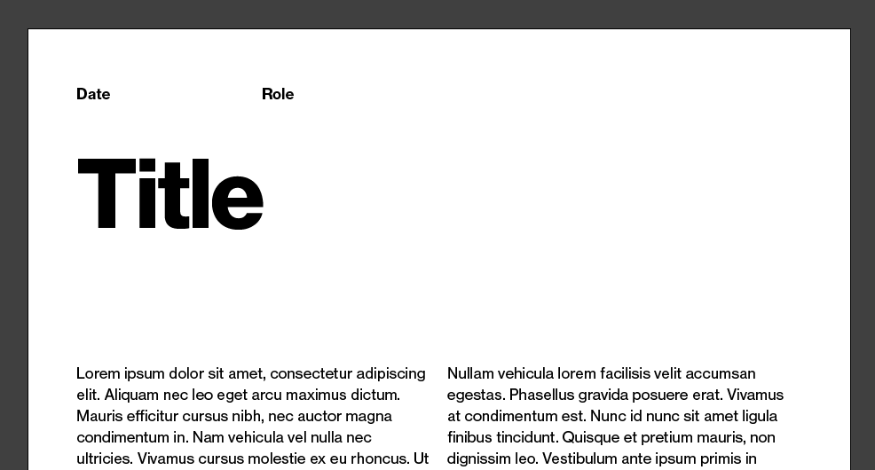

Working on a gigantic project in InDesign, I found myself with lots of pages descending from the same master; filled with placeholders to be filled out each time. It looked something like this:

My attention span is _way_ too short to keep track of each occurrence of each item across hundreds of pages, and I didn't want to risk missing something out and having placeholder text in my final document so I set about finding a better way to make it obvious when I forgot to change something.

## Paragraph Styles

One of the things that InDesign does best (I missed you 💞) is Paragraph, Character & Object Styles. Each item in my master page is associated with a paragraph style so that was a good place to start. Clicking around I discovered `GREP Styles`, which apply _character_ styles to text matching a regex. Cool!

I created a Character Style called `HIGHLIGHT` that sets its text to a bright pink (hopefully hard to miss!), and created GREP Styles in each of my Paragraph Styles to apply it based on a regex. These were pretty easy! Some of my expressions had one thing in them (e.g. `Title`), some were reused for a few items (so I had one matching `(Date|Role)`; for my placeholder text rather than matching the full string of lorem ipsum I matched for `Lorem.+`.

This works really nicely; I'm sad that I didn't discover it years ago! As soon as you change the text from the default the `HIGHLIGHT` style disappears and your text displays as usual. 

It’s chill because it's really easy to spot mistakes even in the layer browser.

