About a year ago I started thinking about and working on merging typographic design and artificial intelligence. Here are all the things that are in my brain about the subject right now.

## Background
For as long as I’ve been a designer I’ve been captivated by mathematical purity in design systems; a huge fan of Swiss design and especially [Karl Gerstner’s work in programmatic design](https://runemadsen.com/blog/karl-gerstner-designing-programmes/). In 2011 I first had a shot at working on systemized algorithmic web layouts at Prismatic (RIP ⚰); then captivated by the 2014 article about [Flipboard’s layout algorithm](http://engineering.flipboard.com/2014/03/web-layouts/) I resolved to shift my design career towards abstractions and work on meta-(meta-)design systems and tools to enable more powerful forms of thought amongst human designers.

Rolling forward to spring 2015, I started working at The Grid (ostensibly as good a venue as any to explore design systems), and was tasked by Leigh and Dan with making the typography system 'better'.

That was a pretty open ended brief, and it opened up some of the most interesting (and frustrating) periods of exploration and thought in my career. As far as I'm aware the workings of the existing system is still cloaked by my NDA, but it was _essentially_ human-specified and arbitrary. As a reaction to this I defined my own brief as "a system that can understand, select & apply typography with the nuance of an expert human designer". No biggie.

---- 

## Definitions
Occasionally when I talk about working on AI typography people assume I'm designing new fonts. It's an absolutely fascinating area and maybe one I'll play around with eventually, but that assumption stems from a common misnomer. To clarify:
**Typography:** the use of typefaces
**Type design:** the creation of new typefaces

Thanks to [Stephen Coles](http://www.fontbureau.com/blog/clear-definitions/) for a clear definition of that one. If you're interested in using neural networks to _design typefaces_, check out Erik Bern’s excellent [Deep Fonts](http://erikbern.com/2016/01/21/analyzing-50k-fonts-using-deep-neural-networks/) project, a fascinating approximation & visual analysis of 50 000 fonts. That said, on to AI Typography - using computers to design with typefaces.

---- 

## A Room Full of Hungover 18 year olds

Designing an AI system that could recreate a core discipline of a complex profession turned into a bit of a challenge. For one, I had to learn about AI and all of its disciplines, on the job, from first principles (I don't have a computer science background, and I was the only design-engineer on the project - we were spread super thin). At the time I was going for a daily evening walk around Pacific Heights to take a break from my screen, look at the sunset and mull over the enormity of the task. On one such walk an Alan Turing quote popped into mind. 

> Instead of trying to produce a programme (sic) to simulate the adult mind, why not rather try to produce one which simulates the child's? If this were then subjected to an appropriate course of education one would obtain the adult brain.
> —Alan Turing[^1]

What if, instead of looking at design as a whole, I looked at design as a series of models based on the education of a human designer?

I believe in the intervening 65 years that methodology has largely been disproved amongst AI purists, but as a naïve starting point it seemed reasonable enough.

## Design School

A common theme of criticism whenever I talk about algorithmic design is that it’s too nuanced a discipline to recreate algorithmically. That creativity can't be reduced down to a series of rules (typography is the most rule-heavy thing in the creative arts, c'mon!). Presumably that criticism is discounting how it's taught in design school - as a series of lessons applied to a lossy medium: the brains of hungover 18 year olds. Staggeringly, amongst the freshman's preoccupation with partying, we also learnt how to design. Hopefully with more computationally attentive platforms, we'll get even better results.

## 0. Learning to see
The thing about design is you don't need to be a designer to experience it. In the west we have hundreds of years of shared visual culture - we _feel_ what things communicate a priori, even if we can't quite label them.

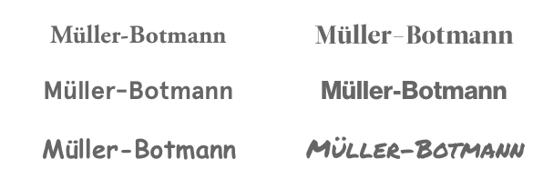

The whole point of graphic design is to evoke an emotion in a target audience - occasionally designers; more often the 'general public'. Those untrained in the dark arts of colors, shapes & banal arguments about kerning. Yet design still manages to communicate with them. If non-designers _didn't_ get semiotic hints from typefaces (and colors and shapes and the rest) then we wouldn't have a job. Non-designers get emotionally moved by design without quite understanding why.

Computers, on the other hand, don't understand design at all. Not in the slightest. To a computer, fonts are a series of `.otf` files and a `string` giving them a name. To a computer, colors are a series of hexadecimal, RGB or HSL references. Computers, by default, aren't even on a level playing field with non-designer humans.

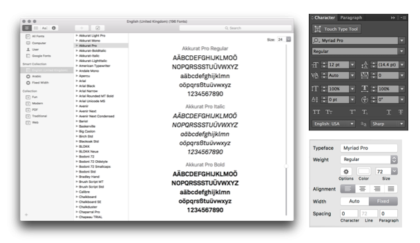

What to computers are lowly strings—the humblest of data structures—to humans are powerful, emotive forms of communication. Rectifying that would surely be a prerequisite to taking our algorithms through design school.

Design school provides a mapping from the emotional to the rational - we learn _why_ elements create emotional reactions in our brains, and how to utilize those motifs to recreate emotions in others. We learn the jargon; learn to tell apart `Grotesque` & `Humanist`, `Didone` & `Transitional`, `Fraktur` & `Rotunda`. We learn how to identify a font by its meta attributes: `x-height`, `contrast`, `width`, `ascenders`, `counters` and too many more to name.

> The purpose of abstraction is not to be vague, but to create a new semantic level in which one can be absolutely precise
> —Edsger Dijkstra[^2]

This new, precise terminology gives us the grounding to learn & apply rules & systems in our work; we can target fonts with such an x-height, or contrast, or whatever we need. We identify fonts with precision and specificity, rather than a raw judgment of "I just kinda like it".

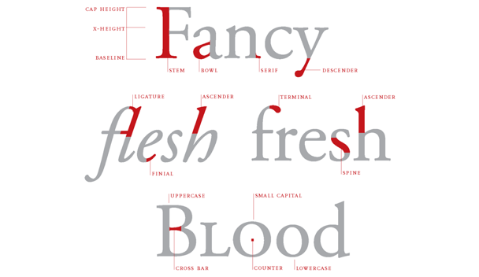

What we need to do, then, is give computers those same data points for labelling & choosing fonts.

At first glance we could annotate fonts by hand, but this presents several problems:
- It takes a long time, and I'm super lazy.
- It's open to interpretation from outside the system
- It's not smart, and won't scale - the system can't grow without human hand-holding. Gross.

Whilst the first argument was more than enough to convince _me_ to never do anything requiring human assistance, presumably the next two work for you. So how do we do we classify fonts algorithmically?

### A raster approach
My first reaction was to _look_ at the fonts. Something involving computer vision and classification, perhaps. For a few months I went down a rabbit hole of trying to draw fonts and measure their pixel values. I figured if I was smart about how I constructed pixel arrays of certain characters I could slice up chunks of them and figure out what they looked like.

_this was a terrible idea_. to get something I could run quickly & repeatedly I used PhantomJS and HTML5 canvas. Drawing webfonts in canvas sucks. Trying to do anything visually complex in PhantomJS sucks. It's been 9 months and I've repressed most of that branch of failures; but I figured I'd mention it because that led me to…

### Vectors!
After swearing at PhantomJS and bitmapped graphics for the millionth time in the middle of an un-airconditioned Berlin heatwave I decided to start over. I was working on a pixel-by-pixel basis, because I was framing the problem as a 'looking' problem, and computer vision revolves around pixels. There had to be another way!

Typefaces are vectors making any calculations super easy. _It's just geometry_. I started writing a lil helper to parse font files and turn them into SVGs when I found a better solution - [opentype.js](http://opentype.js.org/) is a parser for OpenType and TrueType files, that lets you access all the letterforms as vectors, along with the full set of embedded opentype data, in node.js & the browser. Excellent!

With a reliable way to reason about typefaces I moved onto creating algorithms to label the features. Here are some examples:

The x-height is the height of the lowercase x; an easy place to start! To get a value normalizable across fonts (which may be drawn in incongruent sizes), we can record it as a percentage of the uppercase A. This tends to get values between ~0.45-0.8, which sounds about right.

	
	(defn x-height [font]
	  (/ (char-height font :x) (char-height font :A)))

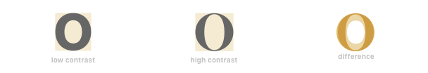

Certain characters really show off a font's contrast. Most notably, overlaying an 'O', 'o' or 'A' gives us a pretty clear sense of how fonts are diverging. The contrast can be expressed thus

	
	(defn contrast [font]
	  (/ (char-area font :O) (char-bounding-box font :O)))

Looking at characters that vary the most amongst changing font widths, 'M' and 'N' are exciting to observe, amongst a few others. We can't just measure their widths (because fonts are drawn at different sizes) so I grabbed the mean of the _ratio_ between their height & widths. cool.

	
	(defn width-ratio [font]
	  (mean [(/ (char-width font :M) (char-height font :M))
	         (/ (char-width font :N) (char-height font :N))]))

And then an interesting topic came up. I was looking at some similar fonts in my design program. Consider Gotham, Proxima Nova & Avenir; Tiempos Headline & Leitura Display; San Francisco, Aktiv Grotesk & Helvetica; or Aperçu, Patron & Maison Neue.

A consistent rule of thumb when pairing typefaces is to go for those with sufficient contrast relative to each other. A pairing of Gotham and Proxima Nova would be exceptionally rare; a pairing of Gotham with an interesting serif would be more interesting.

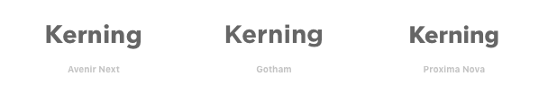

Then there are times when you _would_ want certain attributes to be similar. Perhaps you'd like to pair otherwise-contrasting fonts with similar x-heights, for example.

I created a _similarity score_, showing you the euclidean distance between arbitrary groups of properties. By default it displays the distance between every property of a font, but it can equally be used to show the difference between fonts just taking into consideration, say, `x-height` & `contrast`.

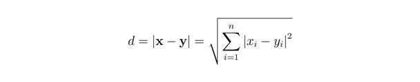
	
	(defn similarity [x y & attrs]
	  (if (empty? attrs)
	        (recur x y [:x-height :contrast :width])
	        (euclidean-distance (map x attrs) (map y attrs))))
	
	(similarity helvetica aktiv-grotesk [:x-height :contrast]) ;; etc

After creating a bunch of these algorithms, I ran it on some sample data (some of my favorite local fonts), scaled the numbers between 0 & 1, and plotted the results.

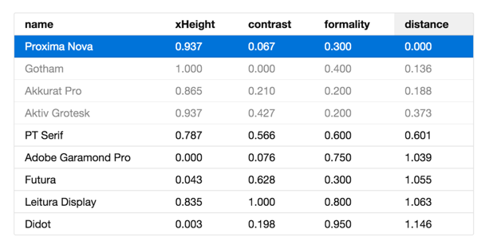

I'd call that a result! Ordering by similarity, Proxima Nova & Gotham are indeed right next to each other whilst Didot is super far away. This is what I expected to happen, but it was great to see the code figure it out.

Of course a dataset of 9 items is hardly exciting, so I went crazy and ran the code on the whole Google Fonts repository.

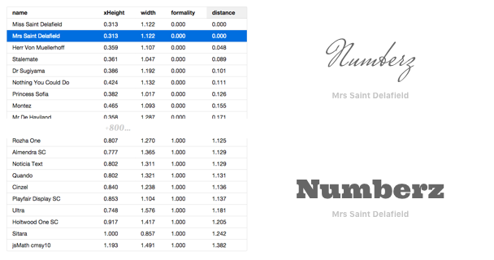

Again, the results seemed to confirm how I hoped the code would work. Previewing the fonts inline (because my brain doesn't have a working memory of the 800+ fonts in the library) shows distances being calculated usably.

A table isn't a type system, so I moved on to the first stage of my Design School theory: rules.

## 1. Rules-based systems (WIP)

!!! muller-brockmann img

Learning rules is a core part of a graphic design education.

predicate logic

selection
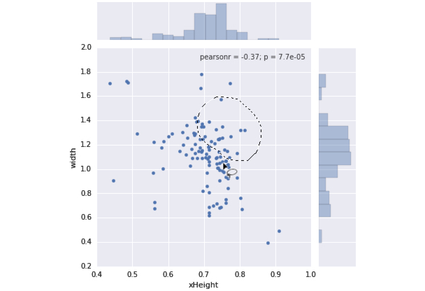

composable solvers

iTunes / Finder analogies

So this was cool - we could specify meta-rules like "show me fonts with these sort of properties", rather than "show me this font and this font" — understanding fonts at a higher level. "given this _sort of font_ as a headline, pair with fonts with these _sort of properties_ for body copy." "if a font _like this_ appears on the page, never pair it with a font _like this_". I think the actual rules as implemented are less exciting than the theory (because rules could be tweaked); the general idea is reasoning about typefaces on a higher-level than by names alone.

	
	(defn small-x-height?
	 [font]
	   (<= (font :x-height)
	       0.75))
	
	(defn too-similar?
	 [a b min & attrs]
	   (>= min
	       (similarity a b attrs)))
	
	(defn legible-serif
	 [font]
	   (and (= :serif (font :formality))
	        (not (small-x-height font))))
	
	(defn pair
	 "given a display font, find a legible
	  serif for the body that isn't too similar"
	 [library display]
	 (->> library
	   (filter legible-serif)
	   (filter
	     (fn [body]
	       (not
	         (too-similar display body 0.35))))))

## 2. Macro Observation
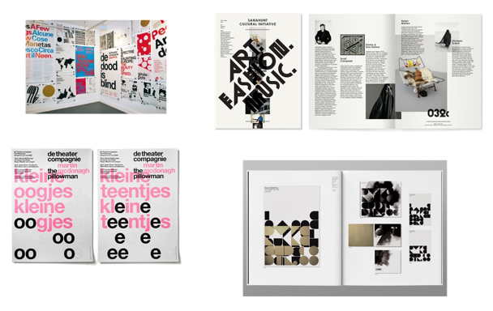

Creating these rules was getting increasingly manual, and I was keen for a solution that learnt from the industry; relating usage back to numbers.

As a student you have your heroes in the industry. A growing knowledge of design allows you to relate their work back to your own — "ohhh, they tend to use these fonts in these contexts", "ahh, they get that effect by pairing fonts of this size with fonts of that size". "they've used this font because of this; they've used it because it has these kind of properties".

Some of my favorite studios were Experimental Jetset, Spin, and Non-Format and lots of winter evenings in college were spent poring over their work, trying to figure out how they achieved the aesthetics they did. I'd never dream of copying their work in projects, but that for of observation is hugely valuable as a learning exercise.

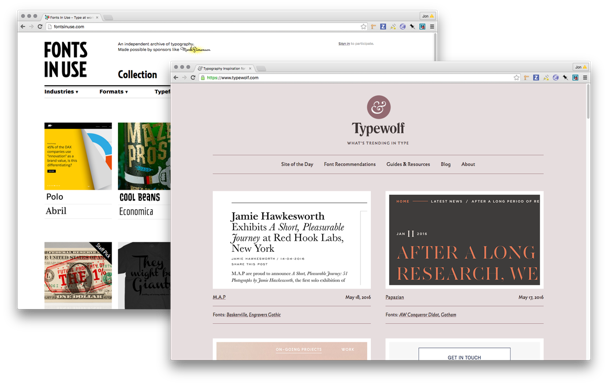

I decided to model this way of learning by looking at how designers use & pair fonts in the real world. This could have been a manual process, but it was more exciting to write scrapers for some of my favorite typography-focused design inspiration sites, and be able to visualize the relationships.

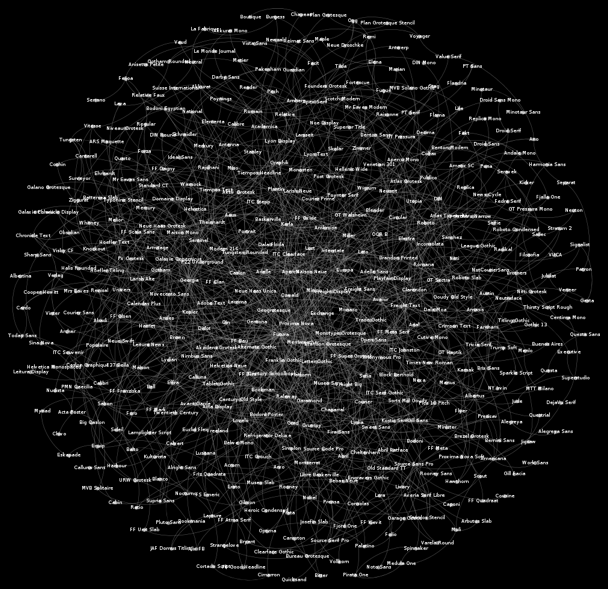

thousands and thousands of lovely pairings later, I had a directed graph of popular font pairings. It could be queried per font, or by date, or by popularity.

relating this _back_ to the first, rules-based model of typography let's us answer questions like "_why_ is this pairing popular? ah! because it has these sort of properties"

## 3. Local Observation

## so then what happened?

[^1]:	Alan Turing, [Computing Machinery and Intelligence](http://www.loebner.net/Prizef/TuringArticle.html), 1950

[^2]:	Edsger Dijkstra, [The Humble Programmer](https://www.cs.utexas.edu/~EWD/transcriptions/EWD03xx/EWD340.html), 1972