About a year ago I started working on merging typographic design and artificial intelligence. I'm writing the contents of my brain to hypertext right now, in May 2016: partially because it's fun to talk about, partially as journalling for my future self, and mostly because I want more people to think about these things.

## Background
For as long as I’ve been a designer I’ve been captivated by mathematical purity in design systems. I've always been a huge fan of Swiss design; maybe my all-time favorite designer is Karl Gerstner with his work in [programmatic design](https://runemadsen.com/blog/karl-gerstner-designing-programmes/). In 2011 I had my a first quick shot at working on systemized algorithmic web layouts at Prismatic (RIP); then captivated by the 2014 article about [Flipboard’s layout algorithm](http://engineering.flipboard.com/2014/03/web-layouts/) I resolved to shift my design career towards abstractions and work on ((meta-)meta-)meta-design systems and tools to enable more powerful forms of thought amongst human designers.

Rolling forward to spring 2015, I started working at The Grid - a startup working on AI-generated websites. For context, the product was somewhere around a Squarespace or Wix kind of deal - it allowed for non-designers to quickly create great looking websites. The twist was that instead of templates or themes, sophisticated design algorithms would work with the content to design a website custom to the user. Cool. As good a venue as any to explore design systems; I was tasked by the creative director and CEO to make the typography system 'better'.

That was an open ended brief, and it led to some of the most interesting periods of exploration and pondering in my career. As far as I'm aware the workings of the preexisting typography system are still cloaked by my NDA, but it was _essentially_ human-specified. As a reaction to this I defined my own brief as **"a system that can understand, select & apply typography with the nuance of an expert human designer"**. No biggie.

---- 

## Definitions
Occasionally when I talk about working on AI typography people assume I'm designing new generative fonts. It's an absolutely fascinating area and maybe one I'll play around with eventually, but that assumption stems from a common misnomer. To clarify, before we get started and you get disappointed with this essay:

**Typography:** the use of typefaces  
**Type design:** the creation of new typefaces

Thanks to [Stephen Coles](http://www.fontbureau.com/blog/clear-definitions/) for a concise definition. If you're interested in using neural networks to _design typefaces_, check out Erik Bern’s excellent [Deep Fonts](http://erikbern.com/2016/01/21/analyzing-50k-fonts-using-deep-neural-networks/) project, an approximation & visual analysis of 50 000 fonts. That said, on to AI Typography - using computers to design with typefaces.

---- 

Designing an AI system that could recreate a core discipline of a complex profession turned into a bit of a challenge. For one, I had to learn about AI and all of its disciplines, on the job, from first principles (I don't have a computer science background, andd I was the only design-engineer on the project - we were spread super thin). At the time I was going for a daily evening walk around Pacific Heights to take a break from my screen, look at the sunset and mull over the enormity of the task. On one such walk an Alan Turing quote popped into mind. 

> Instead of trying to produce a programme (sic) to simulate the adult mind, why not rather try to produce one which simulates the child's? If this were then subjected to an appropriate course of education one would obtain the adult brain.
> 
> — Alan Turing, [Computing Machinery and Intelligence](http://www.loebner.net/Prizef/TuringArticle.html), 1950

What if, instead of looking at design as a whole, I looked at design as a series of models based on the education of a human designer?

I believe in the intervening 65 years that methodology has largely been disproved amongst AI purists, but as a naïve starting point it seemed reasonable enough.

## A roomful of hungover 18 year olds

A common theme of criticism whenever I talk about algorithmic design is that it’s too nuanced a discipline to recreate algorithmically. That creativity can't be reduced down to a series of rules (typography is the most rule-driven thing in the creative arts, c'mon!). Presumably that criticism is discounting how it's taught in design school - as a series of lessons applied to a lossy storage medium: the brains of hungover 18 year olds. Lots of us were them, at one point. Staggeringly, amongst the freshman preoccupation with partying, we also learnt how to design. Hopefully with more computationally attentive platforms, we'll get even better results.

**Design is absolutely teachable, and I have a 4 step process for teaching it to machines**. The process is written about below in the context of typography but it's equally applicable to layout, color, and every other subdiscipline of graphic design.

I've used a mix of pseudo-code and illustrations - apologies if it's too technical or not technical enough 🙏

## Part 1: Learning to see
The thing about design is you don't need to be a designer to experience it. In the west we have hundreds of years of shared visual culture - we _feel_ what things communicate a priori, even if we can't quite label them.

")

The goal of graphic design is to evoke an emotion in a target audience - occasionally designers; more often the 'general public'. Those untrained in the dark arts of colors, shapes & banal arguments about keming. Yet design still manages to communicate with them. If non-designers _didn't_ get semiotic hints from the primitives of design then we wouldn't have a job. Non-designers get emotionally moved by design without quite understanding why.

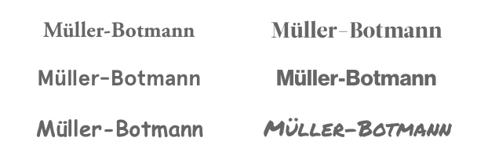

Computers, on the other hand, don't understand design at all. Not in the slightest. To a computer, fonts are a series of `.otf` files and a `string` giving them a name. To a computer, colors are a series of hexadecimal, RGB or HSL references. Computers, by default, aren't even on a level playing field with non-designer humans.

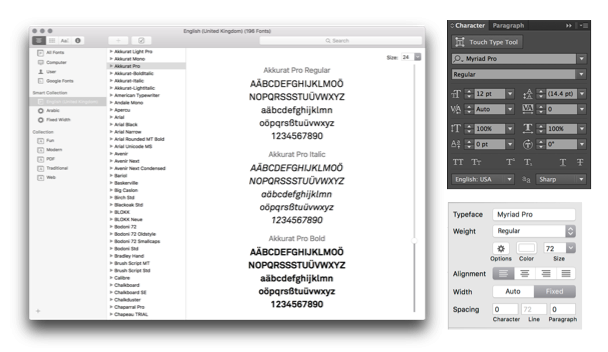

What to computers are lowly strings—the humblest of data structures—to humans are powerful, emotive forms of communication. A human couldn't design with the names of fonts only. We have to see them and know them, and so should computers. Rectifying that would surely be a prerequisite to taking our algorithms through design school.

Design school provides a mapping from the emotional to the rational - we learn _why_ elements create emotional reactions in our brains, and how to utilize those motifs to recreate emotions in others. We learn the jargon; learn to tell apart `Grotesque` & `Humanist`, `Didone` & `Transitional`, `Fraktur` & `Rotunda`. We learn how to identify a font by its meta attributes: `x-height`, `contrast`, `width`, `ascenders`, `counters` and too many more to name.

> The purpose of abstraction is not to be vague, but to create a new semantic level in which one can be absolutely precise
> 
> — Edsger Dijkstra, [The Humble Programmer](https://www.cs.utexas.edu/~EWD/transcriptions/EWD03xx/EWD340.html), 1972

This new, precise terminology gives us the grounding to learn & apply rules & systems in our work; we can target fonts with such an x-height, or contrast, or whatever we need. We identify fonts with specificity, rather than a raw judgment of "I just kinda like it".

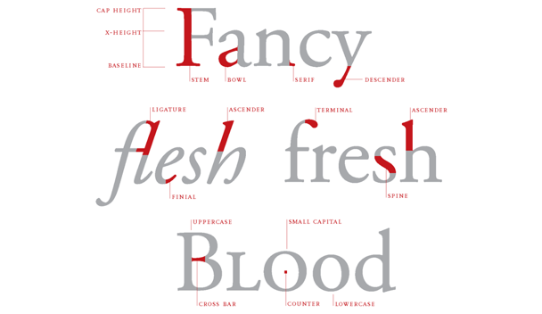

What we need to do, then, is give computers those same vocabulary for labelling & choosing fonts.

At first glance we could annotate fonts by hand; filling spreadsheets with guesstimated values for the components of their anatomy. This presents two problems:
- It takes a long time, and I'm profoundly lazy.
- It's not smart, and won't scale - the system can't grow without human hand-holding. It _could work_, but where's the fun in that?

Whilst the first argument was more than enough to convince _me_ to never do anything requiring human assistance, presumably the second works for you. So how do we do we classify fonts algorithmically?

### A raster approach
My first reaction was to _look_ at the fonts. Something involving computer vision and classification, perhaps. I figured if I was smart about how I constructed certain characters I could slice up chunks of them and figure out what they looked like. I fell down a rabbit hole of pixels, trying to draw fonts and measure what came out in fuzzy antialiased technicolor.

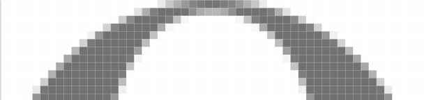

This was an understandable starting point, but not the most efficient. To get something I could run quickly & repeatedly I used PhantomJS and HTML5 canvas. Drawing webfonts in canvas sucks. Trying to do anything visually complex in PhantomJS sucks. It's been 9 months and I've repressed most of that branch of failures; but I figured I'd mention it because that led me to…

### Vectors!
After cursing at PhantomJS and bitmapped graphics for the millionth time in the middle of an relentless Berlin heatwave I decided to start over. I was working on a pixel-by-pixel basis, because I was framing the problem as a 'looking' problem, and computer vision revolves around pixels. There had to be another way!

Typefaces are vectors making any calculations super easy. _It's just geometry_. I started writing a little library to parse font files and turn them into SVGs but quickly found a better solution. [opentype.js](http://opentype.js.org/) is a parser for OpenType and TrueType files, that lets you access all the letterforms as vectors, along with the full set of embedded opentype data, in node.js & the browser. Excellent!

With a reliable way to reason about typefaces I moved onto creating algorithms to label the features. Here are some examples:


The x-height is the height of the lowercase x; an easy place to start! To get a value normalizable across fonts (which may be drawn in incongruent sizes), we can record it as a percentage of the uppercase A. This tends to get values between ~0.45-0.8, which sounds about right.


```clojure
(defn x-height [font]
  (/ (char-height font :x) (char-height font :A)))
```

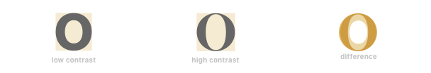

Certain characters really show off a font's contrast. Most notably, overlaying an 'O', 'o' or 'A' gives us a pretty clear sense of how fonts are diverging. The contrast can be expressed thus

```clojure
(defn contrast [font]
  (/ (char-area font :O) (char-bounding-box font :O)))
```


Looking at characters that vary the most amongst changing font widths, 'M' and 'N' are exciting to observe, amongst a few others. We can't just measure their widths (because fonts are drawn at different sizes) so I grabbed the mean of the _ratio_ between their height & widths. cool.

```clojure
(defn width-ratio [font]
  (mean [(/ (char-width font :M) (char-height font :M))
         (/ (char-width font :N) (char-height font :N))]))
```

And then an interesting topic came up. I was looking at some similar fonts in my design program. Consider Gotham, Proxima Nova & Avenir; Tiempos Headline & Leitura Display; San Francisco, Aktiv Grotesk & Helvetica; or Aperçu, Patron & Maison Neue.

A consistent rule of thumb when pairing typefaces is to go for those with sufficient contrast relative to each other. A pairing of Gotham and Proxima Nova would be exceptionally rare; a pairing of Gotham with an interesting serif would be more interesting.

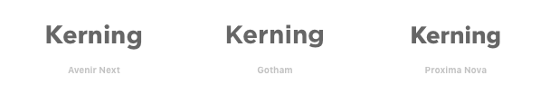

Then there are times when you _would_ want certain attributes to be similar. Perhaps you'd like to pair otherwise-contrasting fonts with similar x-heights, for example.

I created a _similarity score_, showing you the euclidean distance between arbitrary groups of properties. By default it displays the distance between every property of a font, but it can equally be used to show the difference between fonts just taking into consideration, say, `x-height` & `contrast`.

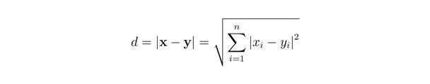

```clojure
(defn similarity [x y & attrs]
  (if (empty? attrs)
        (recur x y [:x-height :contrast :width])
        (euclidean-distance (map x attrs) (map y attrs))))

(similarity helvetica aktiv-grotesk [:x-height :contrast]) ;; etc
```

After creating a bunch of these algorithms, I ran it on some sample data, scaled the numbers between 0 & 1, and plotted the results.

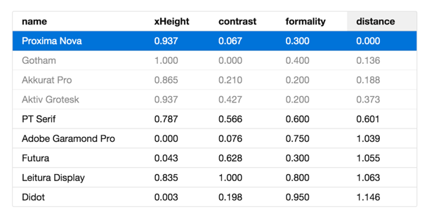

I'd call that a result! Ordering by similarity, Proxima Nova & Gotham are indeed right next to each other whilst Didot is super far away. This is what I expected to happen, but it was great to see the code figure it out.

Of course a dataset of 9 items is hardly exciting, so I went crazy and processed the whole Google Fonts repository.

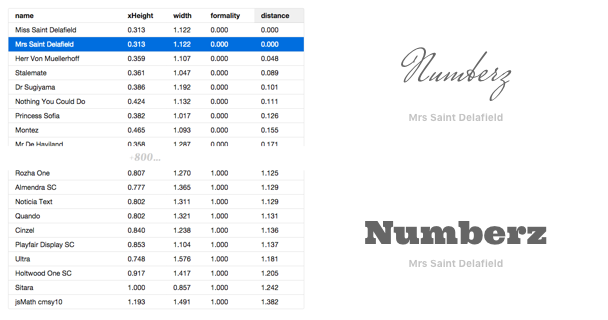

Again, the results seemed to confirm how I hoped the code would work. Comparing the previews of the fonts to their scores we see the numbers matching up - fantastic!

A `<table>` isn't a type system, so I moved on to the first stage of my Design School theory: rules.

## Part 2: Rules-based systems

Design is a series of rules, whether you realize it or not. There are some simple, explicit rules. Lines of text should be around 66 characters wide. Text colors should have appropriate contrast so as to be accessible. Widows and rivers in paragraphs of text should be avoided; the variations in a type scale reduced to provided juxtaposition to each other. These are the explicit rules; those which we can easily write books about.

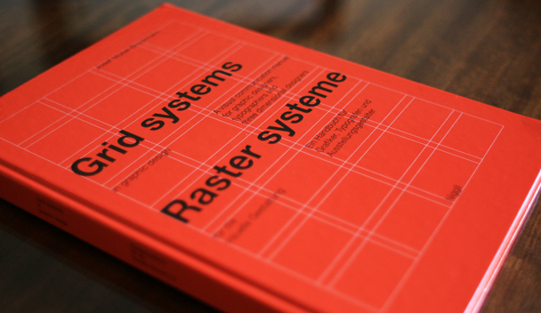

There are also the implicit rules. The implicit rules are the sum of our experience as designers. Every project we've tackled, every thing that could have gone better, or worse; every silver bullet we've remembered. Every solution that didn't quite work at the time, but we'll pull out of our sleeves somewhere down the road.

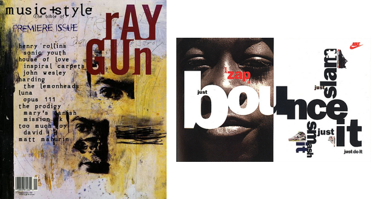

Even those who scoff at modernist design and base their careers around breaking the rules have their own. secretly. David Carson has his rules, and so does Neville Brody. They might not be canonical, or even written down, but we each carry our own set of rules around with us. Frameworks for approaching design; a set of functions that transform brief into deliverables. They might not be visible on the surface, but we can dig and pluck them out.

Working on the premise of rules-based systems, I created a designer-facing API for creating rules. I was inspired by logic programming libraries like [core.logic](https://github.com/clojure/core.logic) and [miniKanren](http://pqdtopen.proquest.com/search.html#abstract?dispub=3380156); aiming for a system that was declarative and compositional.

If that sounds abstract; here are some example of predicate-based solvers that we use every day:

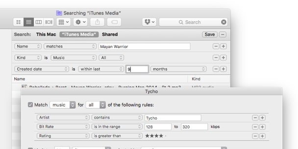

So this was cool - we could specify meta-rules like "show me fonts with these sort of properties", rather than "show me this font and this font" — understanding fonts at a higher level. "given this _sort of font_ as a headline, pair with fonts with these _sort of properties_ for body copy." "if a font _like this_ appears on the page, never pair it with a font _like this_". I think the actual rules as implemented are less exciting than the theory (because rules could be tweaked); the general idea is reasoning about typefaces on a higher-level than by names alone.

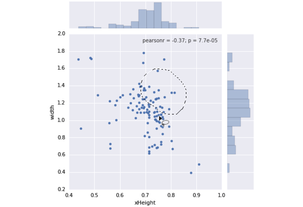

```clojure
(defn small-x-height?
  [font]
    (<= (font :x-height)
        0.75))

(defn too-similar?
  [a b min & attrs]
    (>= min
        (similarity a b attrs)))

(defn legible-serif
  [font]
    (and (= :serif (font :formality))
         (not (small-x-height font))))

(defn pair
  "given a display font, find a legible
  serif for the body that isn't too similar"
  [library display]
  (->> library
    (filter legible-serif)
    (filter
      (fn [body]
        (not (too-similar display body 0.35))))))
```

The plan with all of this was to expose an interface for designers to create and tweak the rules being fed into the system, but before too long I realized a huge part of the model was missing…

## Part 3: Macro Observation
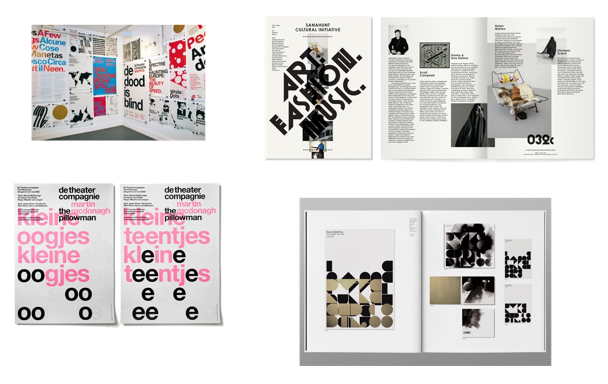

Creating these rules was getting increasingly manual, and I was keen for a solution that learnt from the industry; relating practice back to theory. This is the third part of our model: macro observation.

As a student you have your heroes in the industry; historical and contemporary. A growing knowledge of design allows you to relate their work back to your own; seeing their output as extrapolated out from your own trajectory.

Some of my favorite studios as a student were Experimental Jetset, Spin, and Non-Format. I spent lots of drizzly London winter evenings in college poring over their work, trying to figure out how they achieved their individual aesthetics. Identifying the fonts they used and then researching to figure out why they worked. Looking at the colors they used and figuring out what kind of palettes they derived from. I'd never dream of copying their work in real projects, but that form of observation is hugely valuable as a pedagogical exercise. 

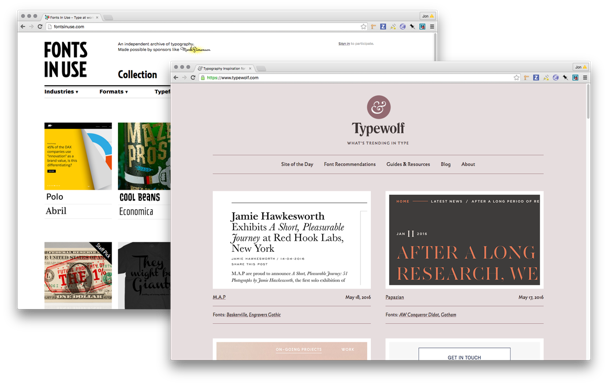

I modelled this form of learning by looking at how designers use & work in the real world. Some of my favorite typography-focused inspiration sites classify work by the typefaces used, building a rich database of the patterns and relationships in the medium. This could have been a manual process, but it was more exciting to write scrapers to grab the data for me. In any case some lines of code and a bunch of HTTP requests later I ended up with a great dataset of real-world font usage.

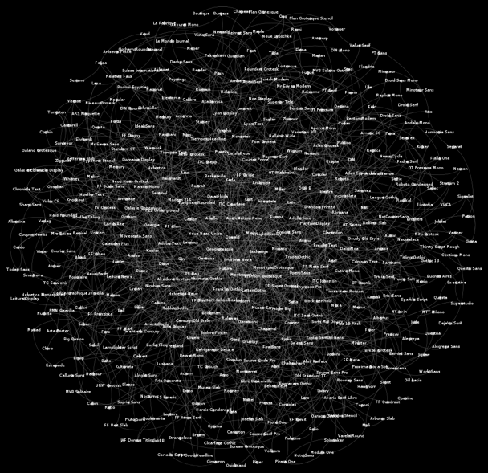

The most natural way to visualize this seemed to be as a node graph, drawing connections between fonts as they are used. It's pretty overwhelming to look at in this form, but the data is captivating and rich. 

The graph on its own suffers the same problem as FontBook though. Whilst the relationships are interesting, they're referring to fonts by name, as strings. If you were reading the previous section and wondering where machine learning would come into an otherwise relatively human-derived constraint system, this is it. By creating a system that can analyze arbitrary fonts and plot them based on geometric features we can turn relationships between _names_ into relationships between rich attributes.

We can query to find common pairings for fonts, but then also traverse out through the graph to find similar and interesting related fonts many degrees out. We can see that a certain group of fonts are becoming more popular, but then infer that it's because they have certain types of properties. The graph tells us _what_ is popular; our geometric system tells us _why_.

It's pretty simple to look at design blogs and realize that Aperçu, Maison Neue, GT Walsheim and LL Circular are popular. To me it's absolutely fascinating for a system to be able to pick out those patterns. A system that can figure out why certain typefaces are becoming popular, and use its knowledge of typography to predict the future of design trends. To come up with combinations humans might not have considered, but seem just as plausible.

## Part 4: Micro Observation 👀
If looking at the industry as a whole builds our understanding of trends on a high level, it's also important to watch other designers close up. How they work. Seeing the decision processes they go through. The routes they try; those they discard, and those they keep. Asking questions, and keeping track of their problem solving skills.

We learn to do this in school, and in internships, and in our first roles as designers; the nascent interactions we have with designers a little older than us, and a lot. We learn equally from our peers, and those designers we look up to a few years older than ourselves, and also from our creative directors' & professors' own work.

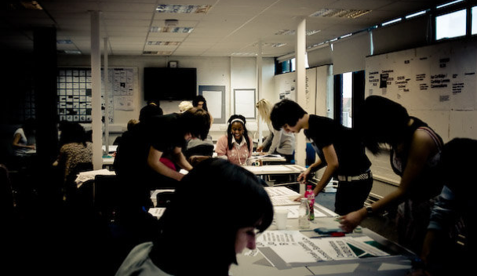

As humans we build models of these other designers: as individuals, small groups, and larger communities. The memes that develop in a studio environment; the motifs that geographically proximate groups of designers share with the wider world and the things that differ. Amongst London design schools there was absolutely a 'Ravensbourne style' pitched against the approaches of students from Kingston, Chelsea, London College of Communication and Central St Martins. But then there was the 'London style' as a whole, too. There was British style; European style. Further afield, the '[Yale style](http://yalegraphicdesign.tumblr.com/)' is instantly recognizable. Outside of school there are cliques that share an understanding without being in the same physical space - trends amongst designers and illustrators that are visible on Dribbble and Behance and wherever else we go to admire each others' work.

The most helpful way to gain a shared understanding with other designers is to sit and pair with them; to sneak glances at their artboards and their ways of crafting. The cool thing about this is it's learnable by algorithms, too; digitally 'looking over designers' shoulders'.

I have some tools that explore this route; observing (with permission) how designers design. The cool thing is that the smarter our algorithms are, the more we can anonymize & abstract the data we need whilst retaining context. This leads to rich and varied training data and lets us spot trends amongst designers. Using in-house design tools at large product companies and design studios, perhaps we can build models of their participants' traits. More on this hybridization of design tools soon.


## Postscript

I left The Grid at the beginning of 2016. For several months prior the typography project had been put on hold due to other company needs; I never got to take it to production. I'm still pretty upset about that. #startuplife.

Of course with hindsight it's easy to see what could have been better, and that's informing my work going forward. The Grid is aiming for a design system that totally abstracts away details for the end user. After all of the smarts that went in to the typography system, I was constrained to expose it via one `<input type="range" />` slider.

Designer friends asking how they could use the system would no doubt be disappointed. Separating the work I did there with the future of artificial intelligence in the design industry, I'm fascinated by how much better designers could be if we are augmented by smart algorithms rather than replaced by them. 

> A study group estimated that it would be 1980 before developments in artificial intelligence make it possible for machines alone to do much thinking or problem solving of military significance. That would leave, say, five years to develop man-computer symbiosis and 15 years to use it. The 15 may be 10 or 500, but **those years should be intellectually the most creative and exciting in the history of mankind.**
> 
> — J. C. R. Licklider, [Man-Computer Symbiosis](http://groups.csail.mit.edu/medg/people/psz/Licklider.html), 1960

Looking at the current crop of design tools after taking a glimpse at the future is frustrating. There is a total lack of contextual and industrial awareness in our software. The tools manipulate strings, vectors and booleans; not design. But tools are the ripest place to affect change, so I'm building design tools that integrate intelligent algorithms with the design process; tools that try to make designers better by learning about what they're doing. What we're doing. Augmenting rather than replacing designers.

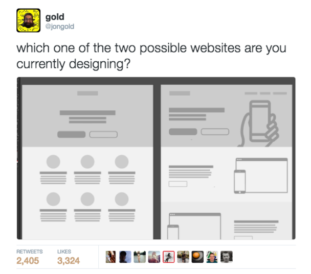

It should always be down to the designer to choose how to use these tools. Optimization is an interesting opportunity for algorithmic design; personally I have no particular goals for making the internet look more homogenous but it's completely valid for some disciplines of design. It doesn't have to be about convergence though; there are many ways to expose and use this data. Our tools could take us towards trends, or away from them. We can, right now, suggest a more popular font, but equally we can surface similar but undiscovered treasures for those looking to branch out from the mainstream. We can suggest, hint and correct; all built from solid design principles and the collective sum of our experience as designers. All this is within reach.

Design is a series of rules, and from rules we learn.

For designers, Licklider was off by a few decades. The Macintosh certainly empowered us to work faster, but we've been stuck on the same semantic level of interaction since 1984. Decades later it feels like we're breaking through to another era. The most exciting and intellectually stimulating years in the history of our industry; the cusp of real designer-computer symbiosis.