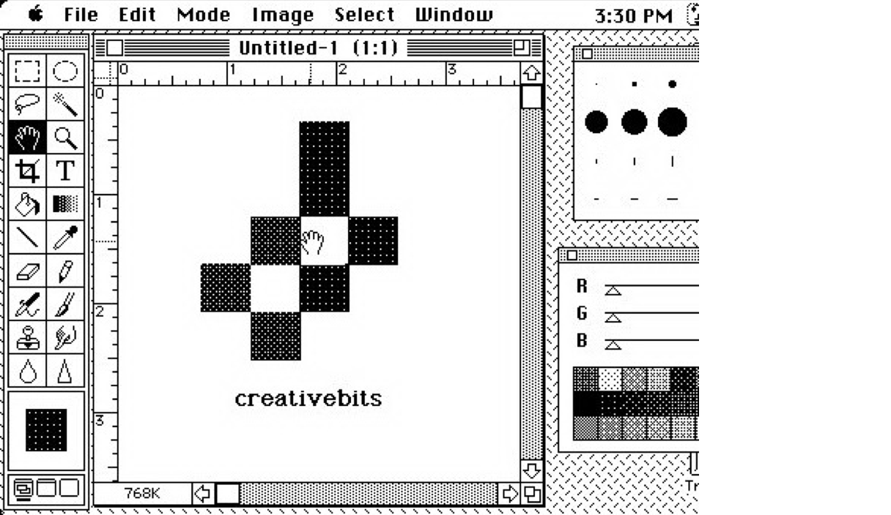
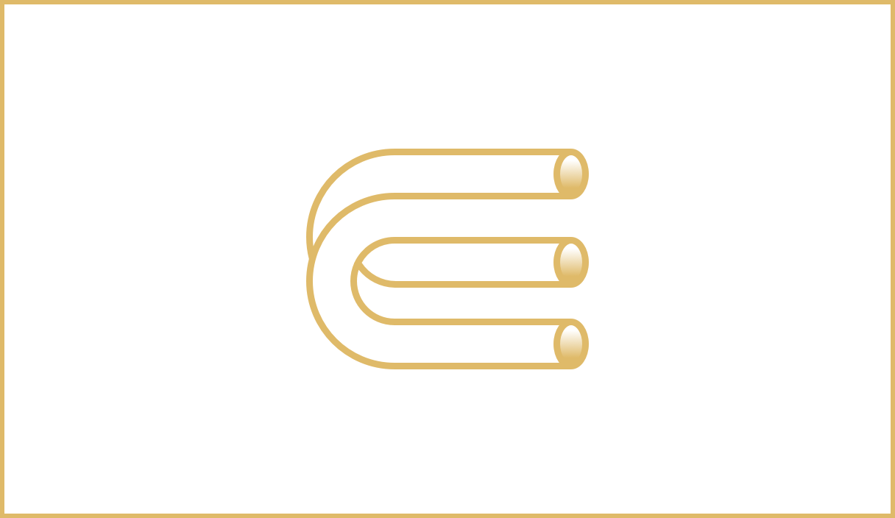
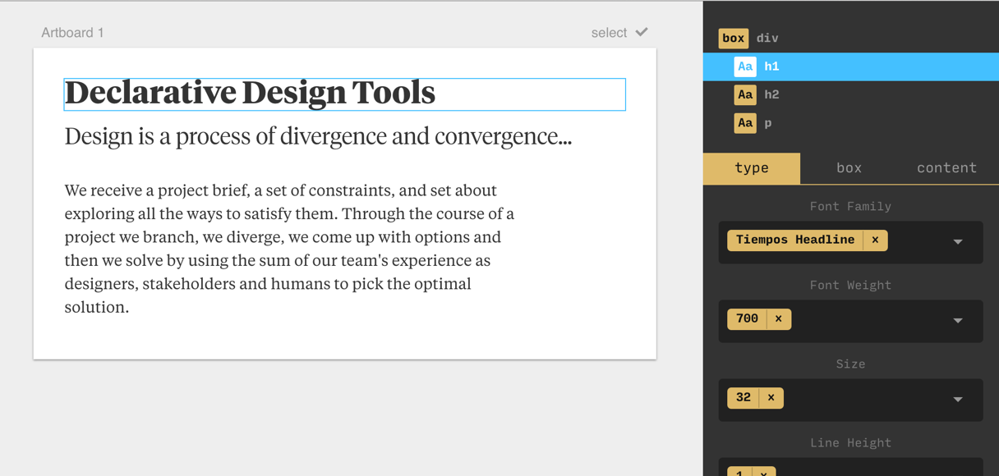

Design is a process of divergence and convergence.

We receive a project brief, a set of constraints, and set about exploring all the ways to satisfy them.  Through the course of a project we diverge, we branch, we come up with options, and then we converge by using the sum of our team's experience as designers, stakeholders, and humans to pick the optimal solution.

This process repeats in increasing levels of fidelity until we are done and the project is finished. We diverge and converge in yellow sticky notes on the wall, in wireframes on whiteboards and in mockup tools, through to high-fidelity final assets: we diverge and converge on a brand identity, a chair, an icon, a house, a website, or a piece of software.

Design is a process of divergence and convergence. Constrain your divergent thought too soon and you're resigned to end up with repetitive solutions and a lack of creativity and depth.

### Our bicycles

Computers are tools for making us better than ourselves. The Steve Jobs quote about computers being ['bicycles for the mind'](https://www.youtube.com/watch?v=ob_GX50Za6c) is so common as to lose meaning nowadays, but it's a fantastic observation.
Computers are extensions of ourselves; tools that let us work better, faster and smarter. Humans aren't likely to spawn wings, dorsal fins or gain the powers of invisibility anytime soon, but in place of biological evolution, we have something more enticing: evolving ourselves through our machines. **We can decide how we want our mental capabilities to evolve and steward that change ourselves.** In this information age, our text editors are the means of production and the means of our transformation.

Our design tools haven't really changed since the introduction of the Mac, though. Over the last 30 years, we've had flings with Quark and Quartz Composer, Corel Draw and Creative Suite, Sketch and SketchUp, Photoshop and Freehand and Fireworks and Framer and Figma, but they all operate on a fundamentally similar principle.

Canvas, document, direct property manipulation. Newer tools are skirmishing over code or nodes rather than drag-and-drop designing, but they're working on the same level. We have a one-to-one mapping to our tools; we edit one font size at a time, one color at a time, one weight at a time, one border radius at a time.



This is a marvelous feat! We have a direct mapping between design in our heads and design on screen. **Given the requisite technical skills, we can bargain with our computers to produce our wildest creative visions.** Rather than speccing out an idea for a poster and waiting days or weeks for a printer—a person, not temperamental inkjet contraption—to realize it (like our Swiss heroes had to), we have a near-instant feedback loop. We think and we artwork: a _one-to-one mapping_. Let that sink in for a second; we'll come back to it later.

### Tales from the design studio
Grab a fistful of twenty-sided dice; it's time for some roleplaying! We're playing a game of _Designers & Deadlines_; a captivating way for people who enjoy arguing about _long shadows_ and _skeuomorphs_ to spend an afternoon.

**DUNGEON MASTER:** Our heroes are a Level 99 Hovering Art Director and a Level 2 Junior Designer. The setting: a design studio. The walls appear to be made of exposed brick; clearly geographically placing us in Shoreditch or Williamsburg or The Mission or Kreuzberg or Södermalm or…

**HOVERING ART DIRECTOR:** This could be anywhere.

**DM:** Fair point. In front of you there are Thunderbolt displays; behind you people are loudly and inconsiderately playing ping pong whilst you're trying to have a design review. Someone in the background is tweeting about how much they love Draplin or feigning incredulity at Designer News or something. To your left, there is a stack of molesk…

**JUNIOR DESIGNER:** This joke is wearing thin; we get it.

**DM:** Then let's begin!

**HAD:** Thanks for taking the time to present those mockups of the article page for the website we're designing. I thought I'd jump in with a couple of quick suggestions and help you tighten up the typography. Let's start with this headline. I'd love to see you try out _these 4 other fonts_. I see you've set it in 26pt type; can you please try 22, 24, 28 or 32pt instead? And that would be great to feel it out in regular, demi, bold and black weights of each. Ooh, and with a margin of 1, 2 or 4 of our vertical rhythm's units.

**JD:** 4 typefaces, 4 sizes, 4 weights… and 3 positions? That's 192 variations!

**HAD:** Indeed it is. Now on to that body copy. How about we see it in _these 6 fonts_; in light and regular; in 15, 16 and 17pt, and in 1.4, 1.5 or 1.6x line-height for good measure?

**JD:** 192 ✕ 6 ✕ 2 ✕ 3 ✕ 3…off the top of my head that's 20,736 variations!

**HAD:** Wonderful. Artwork up each of those, spray-mount them to foam board and let's get them on the wall for the next round of reviews in an hour.

**JD:** 😪

**DM:** I'm so sorry.


Fantastic. Time to get to the digital drawing board.

### Our brains and our eyes

Using our experience and intuition, we formulate options in our head, and then rationalize them in our design tool du jour. We come up with hypotheses of things that might look good, and then run experiments to see what actually works.

Our laboratories are software and rather than messing with hydrocarbons and making explosions, our experiments revolve around copying, pasting, duplicating artboards, changing a detail, trying to remember what we were doing, or getting bored or distracted.

We can't skip this stage; we _need_ to see our hypotheses on a screen or printed. **No designer, no matter how talented or experienced, can design entirely in their head.**

J. C. R. Licklider’s [Man-Computer Symbiosis](http://groups.csail.mit.edu/medg/people/psz/Licklider.html) describes our current workflows with remarkable prescience:

> About 85% of my "thinking" time was spent getting into a position to think, to make a decision, to learn something I needed to know. Much more time went into finding or obtaining information than into digesting it. **Hours went into the plotting of graphs**, and other hours into instructing an assistant how to plot. **When the graphs were finished, the relations were obvious at once, but the plotting had to be done in order to make them so.** At one point, it was necessary to compare six functions relating speech-intelligibility to speech-to-noise ratio. Several hours of calculating were required to get the data into comparable form. **When they were in comparable form, it took only a few seconds to determine what I needed to know.**

Lick was writing in 1960 (56 years ago), in the early years of digital computing. The first experiments into GUIs wouldn't happen at Xerox PARC for over a decade; the release of the Apple ][ (and with it the widespread adoption of personal computers by everyday knowledge workers) was 17 years away.

[The first video](https://www.youtube.com/watch?v=0lvMgMrNDlg) we have of Steve Jobs hinting at the 'bicycles for the mind' analogy was in 1980 (the more famous clip is another decade older).

I'm dwelling on the dates because they're important. Though Lick might not have been fully satisfied by our current tools, the past 56 years have blessed us with a wealth of staggering innovation following his lead. Considering the problems he was writing about—laborious paper plotting of the results of scientific experiments—our spreadsheets and MATLAB simulations surely seem like wizardry.

And yet… our design process is still limited by our meatspace interactions bridging between our brains and devices that have unbounded computational power. **Our brains and computers are fast; our hands, mice and keyboards are slow.**

Designing 20,000 variations of a component is a low figure too - that's only a few fonts and a few sizes. Think of all the possible permutations for every element in the last real project you designed!

Of course, there aren't enough flat whites in the world to keep anyone focused enough to _really_ design 20,000 variations of a component, so we compromise. We skimp. **We fall short of fully exploring the combinatorial space because our design tools haven't really changed since 1984.**

Lick continues, and the parallels sound hauntingly familiar:

> My "thinking" time was devoted mainly to activities that were essentially clerical or mechanical: searching, calculating, plotting, transforming, determining the logical or dynamic consequences of a set of assumptions or hypotheses, preparing the way for a decision or an insight. Moreover, **my choices of what to attempt and what not to attempt were determined to an embarrassingly great extent by considerations of clerical feasibility, not intellectual capability.**

To me, the design process is **just** divergence and convergence; thinking and seeing. Brain and eyes. The middle bits; the exponential time increase between thinking and seeing—that's not design, it's repetitive manual labor. Some people see _that_ as design, but really it's getting in a position to think; _getting in a position to design_. Design is a game for our brains and our eyes.

If we're the type of designer who likes to write computer code, we might start to draw analogies. There is a spectrum in programming paradigms: from imperative to declarative.

**Imperative programming** is telling the computer _how_ to calculate something. We give it step by step instructions—procedures—to get to the answer.

Let's demonstrate this in JavaScript. Imagine we have a list of numbers, and want to square each of them, then add up the total.
```javascript
// imperative
function sumOfSquares(nums) {
  var i, sum = 0, squares = [];
  // make an array of the squares of each input
  for (i = 0; i < nums.length; i++) {
	squares.push(nums[i]*nums[i]);
  }

  // loop through the list
  for (i = 0; i < squares.length; i++) {
	sum += squares[i];
  }

  return sum;
}
sumOfSquares([1, 2, 3, 4, 5]) // 55
```

**Declarative programming**, by contrast, focusses on _what_ we want to calculate - we don't concern ourselves with the details.
```javascript
// declarative
const square = a => a * a
const add = (a, b) => a + b
const sum = reduce(add, 0)
 
// these functions work on their own
square(2) // 4
map(square, [1, 2, 3]) // [1, 4, 9]
add(1, 3) // 4
sum([1, 2, 3]) // 6

// and they work together
const sumOfSquares = pipe(
  map(square),
  sum,
)

sumOfSquares([1, 2, 3, 4, 5]) // 55
```

The declarative example is neat, composable and super readable; the imperative one messy and full of manual array shuffling.


This might seem tangential to the example of our poor junior designer copying & pasting artboards until RSI sets in, but it's an important headspace to be in whilst considering our design tooling. **With our current tools we're telling the computer how to design the vision we have in our head** (by tapping on our input devices for every element on the screen); **in our future tools we will tell our computers what we want to see, and let them figure out how to move elements around to get there.** 

### A smattering of set theory

The cool thing is this that switching our design tools from imperative to declarative isn't a difficult problem to solve: computers have all sorts of fancy and esoteric concepts like _variables_, _loops_, and _arrays_ which we can use to build tools that fix our design process.

Time for a quick math lesson. Here are some sets:

$$
	  Families = \{Akkurat, Gotham, Tiempos\} \\

  Sizes = \{20, 30, 40\}
$$

We can multiply them together like this:

$$
  Families \times Sizes = \{(Akkurat, 20), (Akkurat, 30), (Akkurat, 40), (Gotham, 20), (Gotham, 30) \dots\}
$$

That multiplication is called the **Cartesian product**: all the possible combinations of the items in each set. We can define it in fancy math symbols so people on the internet think we're smart:

$$
 A × B = \{(a, b) | a ∈ A ∧ b ∈ B\} 
$$

That's the _binary Cartesian product_: the product of two sets. We can also derive the _n-ary Cartesian product_; all of the combinations of hella sets (always remember that n- just means 'hella-').

In "I failed math in high school but I'm trying hard to sound clever" symbols, that looks like this:

$$
  \prod_{i=1}^n  S_i=S_1×S_2×\dots×S_n=\{(s_1,s_2,\dots,s_n) \vert s_1 \in S_1 \land s_2 \in S_2 \land ··· \land s_n \in S_n \}
$$

Squinting a little, this is what we're doing (by hand) when we try to artwork all the possibilities of a design problem. We have to copy and paste the artboards ourselves, but we're fundamentally calculating the product of a bunch of properties. Here's an example in colors and shapes:


Now that we have the language to describe why our current tools are slow _(they're imperative! we have to move our meat-hands and tell the computer how to do our work for us!)_ and what we would like them to be _(powerful aids to explore the full permutational space of our designs!)_, we can formulate alternatives.

**A whole world of Declarative Design Tools is waiting to be built; here's mine:**




René is the tool I've been working on since leaving The Grid in February. It's a design tool like those you've used before: it has artboards and layers, fonts, colors, border radiuses; all the bits & pieces you might expect to see:



It just has slightly different input fields. They're input fields that can take a range of options, allowing you to tell the computer all of the variations of a component you'd like to see. **René is a Declarative, Permutational Design Tool.** This is how it works:

<div class="aspect-ratio aspect-ratio--16x9"><iframe class="aspect-ratio--object" width="640" height="480" src="https://www.youtube-nocookie.com/embed/A67gnhoMDvg?rel=0&amp;controls=1&amp;showinfo=1" frameborder="0" allowfullscreen></iframe></div>

Sweet! All the possible combinations of our design. We can add to a list of options we want to try out and see how they work out. It's unbelievably quick. Once we've seen a few options we can zoom back in on one or two—_this is convergence_—and start again. We branch out to visualize lots of different options, then zoom back in on the ones that look good. Divergence and convergence.

Here's another example that demonstrates button variations. We tell René what we want: different fonts, letter-spacings, border-radiuses, and then it shows us all of our options.

<div class="aspect-ratio aspect-ratio--16x9"><iframe class="aspect-ratio--object" width="640" height="480" src="https://www.youtube-nocookie.com/embed/5cgpV5XkeFU?rel=0&amp;controls=1&amp;showinfo=1" frameborder="0" allowfullscreen></iframe></div>

### Brute-force design

Whilst this multiplicative design gives us a huge benefit, we don't want to get carried away with it; our ideal solution sits somewhere between our old school manual design, and brute forcing a solution. Indeed, it would be easy to _just_ produce every possible permutation of design possible. _Every_ combination of every typeface, size, color & position around.
**The problem is that design is a permutationally unbounded space, with a finite range of acceptable options**. We quickly end up with more outcomes than a human can possibly comprehend, but still have to filter them down by hand. Overwhelmed with choice we disconnect; the tool loses meaning.

> Without the aesthetic, the computer is but a mindless speed machine, producing effects without substance.
> 
> — Paul Rand

In my experiments, the ideal range of permutations to explore at each stage is around 4-64. This is a mix of cognition and screen real estate - we can't comprehend many more variations anyway, but we also run out of room to display them on. Plugging in two 27" monitors helps, but I'm more excited by the possibility of AR and VR design tools that let permutations escape the confines of our screens and roam free across the walls in our offices.

**The entire workflow in René might surface many thousands of permutations, but they're experienced through a recurrent process of diverging & converging.**


[You can play with René right now](http://rene.jon.gold). It's still a prototype, but I couldn't really finish this post without a demo, could I? Some things to note:
- Right now, you can only edit one of two files: an article preview, or a button. I've used René to design full websites, but I'm limiting the scope of the demo right now. If you read [Taking The Robots To Design School](http://www.jon.gold/2016/05/robot-design-school) you might be able to piece together why ;)
- The font list is loaded with Google Fonts; you can also use any local fonts by typing them in.
- It's built with React, Redux, Ramda and Flow - all the modern favorites.

[Have fun](http://rene.jon.gold), and let me know what you think on [Twitter](http://twitter.com/jongold)!

✌️👽
